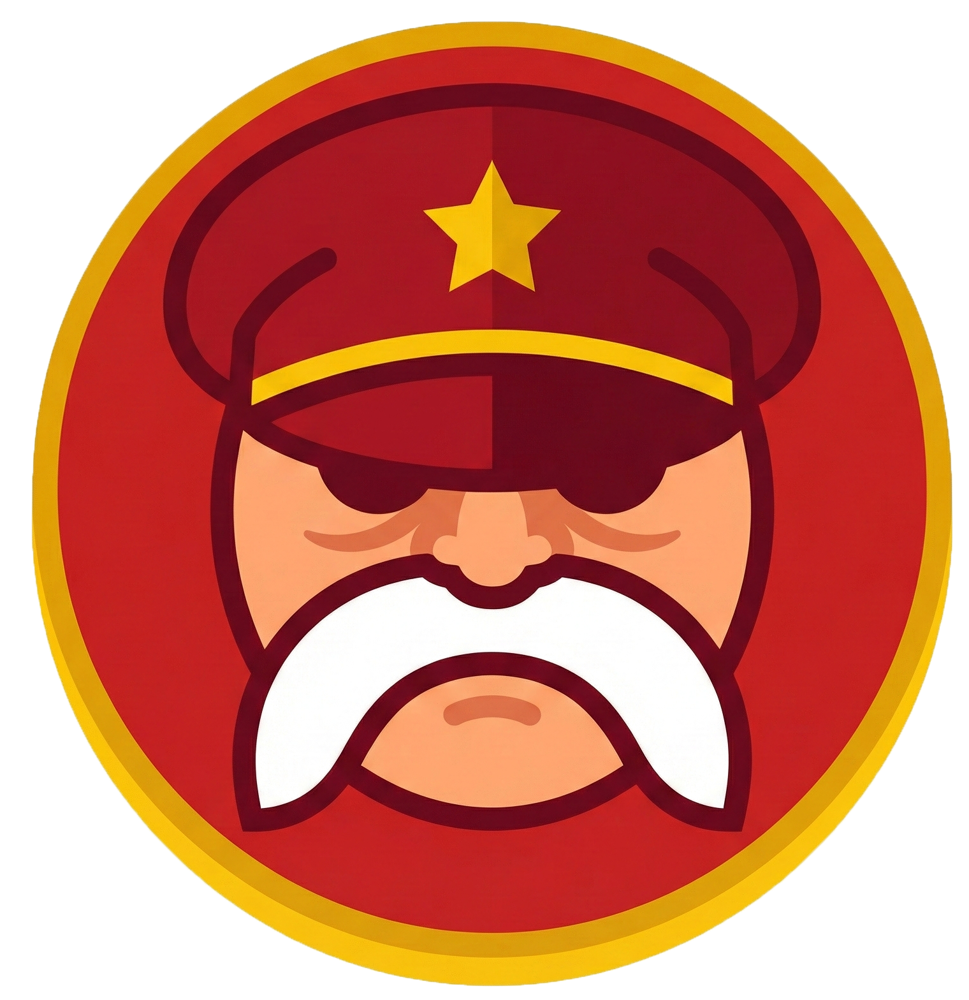
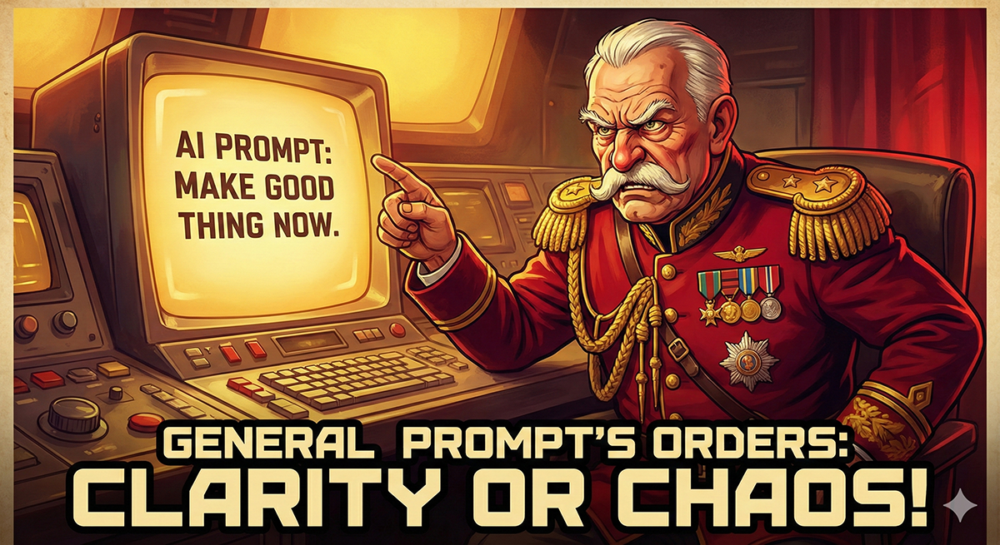

<!DOCTYPE html>
<html lang="pt-BR">
<head>
    <meta charset="UTF-8">
    <meta name="viewport" content="width=device-width, initial-scale=1.0">
    <title>General Prompt (IDE Mode v3.4)</title>
    <link rel="icon" type="image/png" href="assets/icon.png">
    
</head>
<body>
    

        <!-- Mobile Header -->
        

            

                
                General Prompt
            

            <button class="mobile-menu-btn" onclick="toggleSidebar()" aria-label="Open Menu">☰</button>
        

        <!-- Sidebar Overlay -->
        

        <!-- SIDEBAR -->
        

            

                <h1 style="margin:0; display: flex; align-items: center; gap: 10px;">
                    
                    General Prompt
                </h1>
                

                    <!-- Close Button (only visible at 100%) -->
                    <button id="sidebarCloseBtn" class="btn-icon" style="display: none;" onclick="toggleSidebar()" data-i18n-title="btnClose" title="Fechar">
                        ✕
                    </button>
                    <!-- Install Button -->
                    <button class="btn-icon" title="Install Generator in Project" onclick="generateInstallerPrompt()">
                        ⬇️ Install
                    </button>
                

            

            <!-- Sidebar Width Controls -->
            

                

                    <button class="layout-btn sidebar-width-btn active" onclick="setSidebarWidth(50)">50%</button>
                    <button class="layout-btn sidebar-width-btn" onclick="setSidebarWidth(100)">100%</button>
                

            

            <!-- Language & Insert Mode Toggles -->
            

                <!-- Language Toggle -->
                <label class="toggle-switch" title="Switch Language">
                    PT
                    <input type="checkbox" id="langToggle" class="toggle-input" onchange="toggleLanguage()">
                    
                    EN
                </label>
                <!-- Insert Mode Toggle -->
                <label class="toggle-switch" title="Click items to insert at cursor instead of adding to context">
                    <input type="checkbox" id="insertMode" class="toggle-input">
                    
                    Insert Mode
                </label>
            

            

                
Generator
                

                
Library

                
Data

                
About

            

            <!-- TAB: GENERATOR -->
            

                <!-- 1. Agent -->
                

                    
🤖 Agente

                    <select id="agentPersona" onchange="saveState()">
                        <option value="Senior React Engineer">👨‍💻 Senior React Engineer</option>
                        <option value="UI/UX Designer">🎨 UI/UX Designer</option>
                        <option value="Forestry Engineer">🌲 Forestry Engineer / Engenheiro Florestal</option>
                        <option value="Data Scientist">📊 Data Scientist / Cientista de Dados</option>
                    </select>
                    <!-- Dual Sliders -->
                    

                        

                            Criatividade
                            Precisão
                        

                        <input type="range" id="paramCreativity" min="0" max="100" value="50"
                            oninput="updateSliderLabels(); saveState()">
                        
50% vs
                            50%

                    

                    

                        

                            Conciso
                            Detalhado
                        

                        <input type="range" id="paramDetail" min="0" max="100" value="50"
                            oninput="updateSliderLabels(); saveState()">
                        
50% vs 50%
                        

                    

                    

                        

                            Rápido (Quick Fix)
                            Robusto (Best Practice)
                        

                        <input type="range" id="paramRobustness" min="0" max="100" value="50"
                            oninput="updateSliderLabels(); saveState()">
                        
50% vs
                            50%

                    

                

                <!-- 2. Context -->
                

                    

                        📍 Contexto
                        <!-- Global Clear Button -->
                        <button class="btn-danger" style="font-size:10px; padding:2px 6px;" onclick="clearAll()"
                            data-i18n="btnClearAll">🗑️ Clear All Fields</button>
                    

                    

                        

                            <label data-i18n="lblPage">Página</label>
                            

                                <input type="text" class="tag-input-field" id="input-Page" placeholder="+"
                                    autocomplete="off">
                            

                            

                        

                        

                            <label data-i18n="lblTab">Aba</label>
                            

                                <input type="text" class="tag-input-field" id="input-Tab" placeholder="+"
                                    autocomplete="off">
                            

                            

                        

                        

                            <label data-i18n="lblAction">Ação</label>
                            

                                <input type="text" class="tag-input-field" id="input-Action" placeholder="+"
                                    autocomplete="off">
                            

                            

                        

                        

                            <label data-i18n="lblTool">Ferramenta</label>
                            

                                <input type="text" class="tag-input-field" id="input-Tool" placeholder="+"
                                    autocomplete="off">
                            

                            

                        

                    

                

                <!-- 3. Glossary -->
                

                    

                        📚 Glossário
                    

                    

                        

                            <label data-i18n="lblData">Dados</label>
                            

                                <input type="text" class="tag-input-field" id="input-DomainData" placeholder="+"
                                    autocomplete="off">
                            

                            

                        

                        

                            <label data-i18n="lblUI">UI</label>
                            

                                <input type="text" class="tag-input-field" id="input-UIElement" placeholder="+"
                                    autocomplete="off">
                            

                            

                        

                        

                            <label data-i18n="lblVerbs">Verbos</label>
                            

                                <input type="text" class="tag-input-field" id="input-VerbAction" placeholder="+"
                                    autocomplete="off">
                            

                            

                        

                    

                

                <!-- 4. Task (Split) -->
                

                    
📝 Tarefa

                    

                        <label data-i18n="lblCurrent">Situação Atual / Problema</label>
                        <button class="btn-icon insert-last-btn" onclick="insertLastPasted('currentSituation')"
                            title="Inserir último conteúdo colado" disabled style="opacity: 0.3;">📋</button>
                    

                    <textarea id="currentSituation" rows="3" placeholder="O que está acontecendo?" oninput="saveState()"
                        onfocus="setLastFocused(this)"></textarea>
                    

                        <label data-i18n="lblIdeal">Situação Ideal / Solução</label>
                        <button class="btn-icon insert-last-btn" onclick="insertLastPasted('idealSituation')"
                            title="Inserir último conteúdo colado" disabled style="opacity: 0.3;">📋</button>
                    

                    <textarea id="idealSituation" rows="3" placeholder="O que deve acontecer?" oninput="saveState()"
                        onfocus="setLastFocused(this)"></textarea>
                    

                        

                            <label data-i18n="lblTarget">Arquivo Alvo</label>
                            <input type="text" id="targetFile" placeholder="Buscar..."
                                oninput="showFileDropdown(this.value); saveState()" autocomplete="off"
                                onfocus="setLastFocused(this)">
                            

                        

                        

                            <label data-i18n="lblType">Tipo</label>
                            <select id="taskType" onchange="saveState()">
                                <option value="fix">🐛 Bugfix</option>
                                <option value="feature">✨ Feature</option>
                                <option value="refactor">♻️ Refactor</option>
                            </select>
                        

                    

                

                <!-- 5. Tech Context -->
                

                    

                        📋 Contexto Técnico
                        0
                    

                    

                        <input type="text" id="techContextInput" placeholder="Cole link/arquivo..."
                            style="flex: 1; min-width: 150px;"
                            onkeydown="if(event.key==='Enter'){event.preventDefault();addTechContextItem(this.value);}"
                            onfocus="setLastFocused(this)">
                        <button class="btn-secondary"
                            onclick="addTechContextItem(document.getElementById('techContextInput').value)"
                            style="white-space: nowrap; flex-shrink: 0;">
                            ➕
                        </button>
                    

                    

                        💡 Clique em um campo de texto antes de usar "Inserir"
                        
                    

                    

                        

                            Nenhum item adicionado

                    

                

                

            

            <!-- TAB: LIBRARY -->
            

                

                    
📚 Saved Prompts

                    <input type="text" id="librarySearch" placeholder="Search prompts..." oninput="renderLibrary()">
                    

                

            

            <!-- TAB: DATA (EDIT) -->
            

                

                    
📂 Project Manager

                    <!-- Saved Projects -->
                    <label data-i18n="lblSavedProjects">Saved Projects</label>
                    

                        <select id="savedProjectsSelect" style="margin-bottom:0;"></select>
                        <button class="btn-secondary" onclick="loadProject()" data-i18n="btnLoad">Load</button>
                        <button class="btn-danger" onclick="deleteProject()" data-i18n="btnDelete">×</button>
                    

                    

                        <input type="text" id="newProjectName" placeholder="Project Name" style="margin-bottom:0;">
                        <button class="btn-primary" style="width:auto;" onclick="saveProject()"
                            data-i18n="btnSave">Save</button>
                    

                    

                    <!-- Import/Export -->
                    <label data-i18n="lblImportExport">Import / Export</label>
                    

                        <label class="file-upload-label">
                            📂 Import JSON
                            <input type="file" id="importFile" accept=".json" onchange="importProject(this)">
                        </label>
                        <button class="btn-primary" onclick="exportProject()" data-i18n="btnExportJSON">💾 Export
                            JSON</button>
                    

                

                

                    
⚙️ Manage Data

                    
Add or remove items
                        from the dropdown lists.

                    <!-- Shortcuts Buttons -->
                    

                        <button class="btn-secondary" style="width:50%;" onclick="openTermShortcutsModal()"
                            data-i18n="btnTermShortcuts">⌨️ Term Shortcuts</button>
                        <button class="btn-secondary" style="width:50%;" onclick="openPromptShortcutsModal()"
                            data-i18n="btnPromptShortcuts">⌨️ Prompt Shortcuts</button>
                    

                    <label data-i18n="lblSelectList">Select List</label>
                    <select id="dataListSelect" onchange="renderDataEditor()">
                        <option value="Page">Pages</option>
                        <option value="Tab">Tabs</option>
                        <option value="Action">Actions</option>
                        <option value="Tool">Tools</option>
                        <option value="DomainData">Glossary: Data</option>
                        <option value="UIElement">Glossary: UI</option>
                        <option value="VerbAction">Glossary: Verbs</option>
                    </select>
                    

                        <input type="text" id="newDataItem" placeholder="New Item Name">
                        <button class="btn-primary" style="width:auto;" onclick="addDataItem()"
                            data-i18n="btnAdd">Add</button>
                    

                    

                    <!-- Clear Buttons -->
                    

                        <button class="btn-danger" style="width:50%;" onclick="clearCurrentList()"
                            data-i18n="btnClearList">🗑️ Clear Current List</button>
                        <button class="btn-danger" style="width:50%;" onclick="clearAllLists()"
                            data-i18n="btnClearAllLists">🗑️ Clear ALL Lists</button>
                    

                    <button class="btn-secondary" style="margin-top:12px; width:100%;" onclick="resetDataDefaults()"
                        data-i18n="btnReset">Reset to Defaults</button>
                

            

            <!-- TAB: ABOUT -->
            

                

                    
                    

                        
                        <h2 style="margin:0; font-size:24px; font-weight:bold; color:#fff; text-shadow: 2px 2px 4px rgba(0,0,0,0.8);"
                            data-i18n="aboutTitle">GENERAL PROMPT</h2>
                        
AI Command Center

                    

                

                

                    

                        

                            "Sem rodeios, soldado! Quero ordem no caos e prompts claros na minha mesa, AGORA!"
                        

                        
— General Prompt

                    

                    
⚡ Tactical Features

                    

                        

                            🗺️
                            

                                <h3 style="margin:0 0 4px 0; font-size:14px; color:var(--success);"
                                    data-i18n="featureMapTitle">Mapa Mental de Contexto</h3>
                                

                                    Importe a estrutura JSON do seu projeto para fornecer contexto instantâneo e preciso
                                    a cada prompt.
                                

                            

                        

                    

                    

                        

                            📚
                            

                                <h3 style="margin:0 0 4px 0; font-size:14px; color:var(--success);"
                                    data-i18n="featureArsenalTitle">Arsenal de Prompts</h3>
                                

                                    Salve, organize e implemente rapidamente suas estratégias de prompt mais eficazes.
                                

                            

                        

                    

                    

                        

                            ⚡
                            

                                <h3 style="margin:0 0 4px 0; font-size:14px; color:var(--success);"
                                    data-i18n="featureShortcutsTitle">Atalhos Táticos</h3>
                                

                                    Digite / para inserir instantaneamente termos específicos do projeto ou acionar
                                    prompts salvos completos.
                                

                            

                        

                    

                    

                        

                            <strong data-i18n="aboutVersion">Version:</strong> 3.4 |
                            <strong data-i18n="aboutMission">Mission:</strong> Clareza e Precisão em cada comando
                        

                    

                

            

        

        <!-- EDITOR PANE -->
        

            

                

                    <button class="btn-primary" onclick="generatePrompt()" data-i18n="btnGenerate">⚡ Gerar Prompt</button>
                    <button class="btn-secondary" onclick="saveToLibrary()" data-i18n="btnSaveLib">💾 Salvar</button>
                    <button class="btn-danger" onclick="clearPrompt()">🗑️ Limpar</button>
                    <button class="btn-secondary" onclick="openApiSettings()">⚙️ Chave API</button>
                

            

            

                

                    

                        Original Prompt
                        

                            <button class="btn-expand" onclick="copyToClipboard('original')">
                                📋 Copiar
                            </button>
                            <button class="btn-expand" onclick="openFullscreenPrompt('original')">
                                ⛶ Expandir
                            </button>
                        

                    

                    <textarea id="promptOutput" placeholder="O prompt gerado aparecerá aqui..."
                        onfocus="setLastFocused(this)"></textarea>
                

                

                    

                        

                            Refined Prompt
                            
                        

                        

                            <!-- Layout Controls -->
                            

                                <button class="layout-btn" onclick="setLayout(30)">30%</button>
                                <button class="layout-btn" onclick="setLayout(50)">50%</button>
                                <button class="layout-btn active" onclick="setLayout(70)">70%</button>
                            

                            <!-- Refine Buttons -->
                            <button class="btn-expand" onclick="refinePrompt()" data-i18n="btnRefine"
                                style="background-color: var(--success); color: white; border-color: var(--success);">
                                🤖 Detalhado
                            </button>
                            <button class="btn-expand" onclick="refinePromptCompact()" data-i18n="btnRefineCompact"
                                style="background-color: var(--info); color: white; border-color: var(--info);">
                                ⚡ Resumido
                            </button>
                            <!-- Copy & Expand -->
                            <button class="btn-expand" onclick="copyToClipboard('refined')">
                                📋 Copiar
                            </button>
                            <button class="btn-expand" onclick="openFullscreenPrompt('refined')">
                                ⛶ Expandir
                            </button>
                        

                    

                    <textarea id="refinedOutput" placeholder="O prompt refinado aparecerá aqui..."
                        onfocus="setLastFocused(this)"></textarea>
                

            

        

    

    <!-- Fullscreen Modal: Original Prompt -->
    

        

            <h3 data-i18n="lblOriginalPrompt">Original Prompt</h3>
            <button class="fullscreen-modal-close" onclick="closeFullscreenPrompt('original')" data-i18n="btnClose">✕ Fechar</button>
        

        

            <textarea id="fullscreenOriginalTextarea" placeholder="O prompt gerado aparecerá aqui..."></textarea>
        

        

            <button class="btn-primary" onclick="copyFullscreenContent('original')" data-i18n="btnCopy">📋 Copiar</button>
            <button class="btn-secondary" onclick="closeFullscreenPrompt('original')" data-i18n="btnClose">Fechar</button>
        

    

    <!-- Fullscreen Modal: Refined Prompt -->
    

        

            <h3 data-i18n="lblRefinedPrompt">Refined Prompt</h3>
            <button class="fullscreen-modal-close" onclick="closeFullscreenPrompt('refined')" data-i18n="btnClose">✕ Fechar</button>
        

        

            <textarea id="fullscreenRefinedTextarea" placeholder="O prompt refinado aparecerá aqui..."></textarea>
        

        

            <button class="btn-primary" onclick="copyFullscreenContent('refined')" data-i18n="btnCopy">📋 Copiar</button>
            <button class="btn-secondary" onclick="closeFullscreenPrompt('refined')" data-i18n="btnClose">Fechar</button>
        

    

    <!-- Modal Overlay -->
    

    <!-- Modal: Manage Shortcuts for Terms -->
    

        

            <h3 data-i18n="modalTermShortcuts">⌨️ Manage Term Shortcuts</h3>
            <button class="modal-close" onclick="closeAllModals()">&times;</button>
        

        

            Assign shortcut codes to terms from your lists. Type the code in the prompt window to insert the term.
        

        

            <select id="shortcutListSelect" style="margin:0; flex:1;" onchange="renderTermShortcuts()">
                <option value="Page">Pages</option>
                <option value="Tab">Tabs</option>
                <option value="Action">Actions</option>
                <option value="Tool">Tools</option>
                <option value="DomainData">Glossary: Data</option>
                <option value="UIElement">Glossary: UI</option>
                <option value="VerbAction">Glossary: Verbs</option>
            </select>
        

        

    

    <!-- Modal: Manage Shortcuts for Prompts -->
    

        

            <h3 data-i18n="modalPromptShortcuts">⌨️ Manage Prompt Shortcuts</h3>
            <button class="modal-close" onclick="closeAllModals()">&times;</button>
        

        

            Assign shortcut codes to saved prompts. Type the code in the prompt window to load the entire prompt.
        

        

    

    <!-- Modal: API Settings -->
    

        

            <h3 data-i18n="modalApiSettings">⚙️ API Settings</h3>
            <button class="modal-close" onclick="closeAllModals()">&times;</button>
        

        

            Configure your Gemini API key for prompt refinement.
        

        <label data-i18n="lblGeminiApiKey">Gemini API Key</label>
        <input type="password" id="geminiApiKey" placeholder="AIza..." style="margin-bottom: 16px;">
        

            <button class="btn-secondary" onclick="toggleApiKeyVisibility()" style="width: auto;">
                👁️ Show/Hide
            </button>
            <button class="btn-primary" onclick="saveApiKey()" style="flex: 1;">
                Save API Key
            </button>
        

        

            

                <strong data-i18n="lblGetApiKey">Get your free API key:</strong>
            

            <a href="https://aistudio.google.com/app/apikey" target="_blank"
                style="color: var(--accent); font-size: 11px;">
                https://aistudio.google.com/app/apikey
            </a>
            

                Your API key is stored locally in your browser and never sent to our servers.
            

        

    

    <script>
        // --- TRANSLATIONS ---
        const TRANSLATIONS = {
            pt: {
                insertMode: "Modo Inserção",
                tabGenerator: "Gerador", tabLibrary: "Biblioteca", tabData: "Dados", tabAbout: "Sobre",
                aboutTitle: "GENERAL PROMPT", aboutSubtitle: "AI Command Center",
                aboutQuote: '"Sem rodeios, soldado! Quero ordem no caos e prompts claros na minha mesa, AGORA!"',
                aboutFeatures: "⚡ Recursos Táticos",
                featureMapTitle: "Mapa Mental de Contexto", featureMapDesc: "Importe a estrutura JSON do seu projeto para fornecer contexto instantâneo e preciso a cada prompt.",
                featureArsenalTitle: "Arsenal de Prompts", featureArsenalDesc: "Salve, organize e implemente rapidamente suas estratégias de prompt mais eficazes.",
                featureShortcutsTitle: "Atalhos Táticos", featureShortcutsDesc: "Digite / para inserir instantaneamente termos específicos do projeto ou acionar prompts salvos completos.",
                aboutVersion: "Versão", aboutMission: "Missão", aboutMissionText: "Clareza e Precisão em cada comando",
                secAgent: "🤖 Agente", secContext: "📍 Contexto", secGlossary: "📚 Glossário", secTask: "📝 Tarefa", secTech: "📋 Contexto Técnico", secLibrary: "📚 Prompts Salvos", secManageData: "⚙️ Gerenciar Dados", secProjectManager: "📂 Gerenciador de Projetos",
                lblPage: "Página", lblTab: "Aba", lblAction: "Ação", lblTool: "Ferramenta",
                lblData: "Dados", lblUI: "UI", lblVerbs: "Verbos",
                lblCurrent: "Situação Atual / Problema", lblIdeal: "Situação Ideal / Solução",
                lblTarget: "Arquivo Alvo", lblType: "Tipo", lblFiles: "Arquivos/Prints (Cole Aqui)",
                lblSelectList: "Selecionar Lista", lblSavedProjects: "Projetos Salvos", lblImportExport: "Importar / Exportar",
                msgManageData: "Adicione ou remova itens das listas.",
                btnAdd: "Adicionar", btnReset: "Resetar Padrões", btnExportJSON: "💾 Exportar JSON", btnImportJSON: "📂 Importar JSON",
                btnGenerate: "⚡ Gerar Prompt", btnSaveLib: "💾 Salvar", btnClear: "Limpar", btnCopy: "📋 Copiar", btnCopyOriginal: "Copiar", btnCopyRefined: "Copiar", btnRefine: "🤖 Detalhado", btnRefineCompact: "⚡ Resumido", btnApiKey: "Chave API",
                lblOriginalPrompt: "Prompt Original", lblRefinedPrompt: "Prompt Refinado",
                modalApiSettings: "⚙️ Configurações de API", msgApiSettings: "Configure sua chave API do Gemini para refinamento de prompts.",
                lblGeminiApiKey: "Chave API Gemini", btnToggleKey: "Mostrar/Ocultar", btnSaveApiKey: "Salvar Chave API",
                lblGetApiKey: "Obtenha sua chave API gratuita:", msgApiKeySafe: "Sua chave API é armazenada localmente no navegador e nunca é enviada para nossos servidores.",
                refineStatus: { processing: "Processando...", success: "✅ Concluído", error: "❌ Erro", noKey: "⚠️ Configure API Key" },
                btnClearAll: "🗑️ Limpar Tudo", btnInstall: "Instalar", btnLoad: "Carregar", btnSave: "Salvar", btnDelete: "Excluir",
                btnClearList: "🗑️ Limpar Lista Atual", btnClearAllLists: "🗑️ Limpar TODAS as Listas",
                btnTermShortcuts: "⌨️ Atalhos de Termos", btnPromptShortcuts: "⌨️ Atalhos de Prompts",
                btnSetShortcut: "Definir Atalho", btnRemoveShortcut: "Remover",
                modalTermShortcuts: "⌨️ Gerenciar Atalhos de Termos", modalPromptShortcuts: "⌨️ Gerenciar Atalhos de Prompts",
                msgTermShortcuts: "Atribua códigos de atalho aos termos das suas listas. Digite o código na janela de prompts para inserir o termo.",
                msgPromptShortcuts: "Atribua códigos de atalho aos prompts salvos. Digite o código na janela de prompts para carregar o prompt completo.",
                phShortcutCode: "Código (ex: /p1, /d1)",
                phCurrent: "O que está acontecendo?", phIdeal: "O que deve acontecer?", phFiles: "Cole arquivos ou prints...", phSearch: "Buscar...", phLibrary: "Buscar prompts...", phNewItem: "Nome do Novo Item",
                phPromptOutput: "O prompt gerado aparecerá aqui...", phRefinedOutput: "O prompt refinado aparecerá aqui...",
                promptAct: "ATUE COMO", promptTask: "TAREFA", promptTarget: "ALVO", promptContext: "CONTEXTO", promptCurrent: "SITUAÇÃO ATUAL", promptIdeal: "SITUAÇÃO IDEAL / SOLUÇÃO", promptAttachments: "ANEXOS / CONTEXTO",
                slCreativity: "Criatividade", slPrecision: "Precisão", slConcise: "Conciso", slDetailed: "Detalhado", slQuick: "Rápido (Quick Fix)", slRobust: "Robusto (Best Practice)",
                promptParams: "PARÂMETROS",
                btnExpand: "Expandir", btnClose: "Fechar"
            },
            en: {
                insertMode: "Insert Mode",
                tabGenerator: "Generator", tabLibrary: "Library", tabData: "Data", tabAbout: "About",
                aboutTitle: "GENERAL PROMPT", aboutSubtitle: "AI Command Center",
                aboutQuote: '"No nonsense, soldier! I want order in chaos and clear prompts on my desk, NOW!"',
                aboutFeatures: "⚡ Tactical Features",
                featureMapTitle: "Context Mind Map", featureMapDesc: "Import your project's JSON structure to provide instant and precise context to every prompt.",
                featureArsenalTitle: "Prompt Arsenal", featureArsenalDesc: "Save, organize, and quickly deploy your most effective prompt strategies.",
                featureShortcutsTitle: "Tactical Shortcuts", featureShortcutsDesc: "Type / to instantly insert project-specific terms or trigger complete saved prompts.",
                aboutVersion: "Version", aboutMission: "Mission", aboutMissionText: "Clarity and Precision in every command",
                secAgent: "🤖 Agent", secContext: "📍 Context", secGlossary: "📚 Glossary", secTask: "📝 Task", secTech: "📋 Tech Context", secLibrary: "📚 Saved Prompts", secManageData: "⚙️ Manage Data", secProjectManager: "📂 Project Manager",
                lblPage: "Page", lblTab: "Tab", lblAction: "Action", lblTool: "Tool",
                lblData: "Data", lblUI: "UI", lblVerbs: "Verbs",
                lblCurrent: "Current Situation / Problem", lblIdeal: "Ideal Situation / Solution",
                lblTarget: "Target File", lblType: "Type", lblFiles: "Files/Screenshots (Paste Here)",
                lblSelectList: "Select List", lblSavedProjects: "Saved Projects", lblImportExport: "Import / Export",
                msgManageData: "Add or remove items from the dropdown lists.",
                btnAdd: "Add", btnReset: "Reset to Defaults", btnExportJSON: "💾 Export JSON", btnImportJSON: "📂 Import JSON",
                btnGenerate: "⚡ Generate Prompt", btnSaveLib: "💾 Save", btnClear: "Clear", btnCopy: "📋 Copy", btnCopyOriginal: "Copy", btnCopyRefined: "Copy", btnRefine: "🤖 Detailed", btnRefineCompact: "⚡ Compact", btnApiKey: "API Key",
                lblOriginalPrompt: "Original Prompt", lblRefinedPrompt: "Refined Prompt",
                modalApiSettings: "⚙️ API Settings", msgApiSettings: "Configure your Gemini API key for prompt refinement.",
                lblGeminiApiKey: "Gemini API Key", btnToggleKey: "Show/Hide", btnSaveApiKey: "Save API Key",
                lblGetApiKey: "Get your free API key:", msgApiKeySafe: "Your API key is stored locally in your browser and never sent to our servers.",
                refineStatus: { processing: "Processing...", success: "✅ Done", error: "❌ Error", noKey: "⚠️ Setup API Key" },
                btnClearAll: "🗑️ Clear All Fields", btnInstall: "Install", btnLoad: "Load", btnSave: "Save", btnDelete: "Delete",
                btnClearList: "🗑️ Clear Current List", btnClearAllLists: "🗑️ Clear ALL Lists",
                btnTermShortcuts: "⌨️ Term Shortcuts", btnPromptShortcuts: "⌨️ Prompt Shortcuts",
                btnSetShortcut: "Set Shortcut", btnRemoveShortcut: "Remove",
                modalTermShortcuts: "⌨️ Manage Term Shortcuts", modalPromptShortcuts: "⌨️ Manage Prompt Shortcuts",
                msgTermShortcuts: "Assign shortcut codes to terms from your lists. Type the code in the prompt window to insert the term.",
                msgPromptShortcuts: "Assign shortcut codes to saved prompts. Type the code in the prompt window to load the entire prompt.",
                phShortcutCode: "Code (e.g., /p1, /d1)",
                phCurrent: "What is happening?", phIdeal: "What should happen?", phFiles: "Paste files or screenshots...", phSearch: "Search...", phLibrary: "Search prompts...", phNewItem: "New Item Name",
                phPromptOutput: "The generated prompt will appear here...", phRefinedOutput: "The refined prompt will appear here...",
                promptAct: "ACT AS", promptTask: "TASK", promptTarget: "TARGET", promptContext: "CONTEXT", promptCurrent: "CURRENT SITUATION", promptIdeal: "IDEAL SITUATION / SOLUTION", promptAttachments: "ATTACHMENTS / CONTEXT",
                slCreativity: "Creativity", slPrecision: "Precision", slConcise: "Concise", slDetailed: "Detailed", slQuick: "Quick Fix", slRobust: "Robust (Best Practice)",
                promptParams: "PARAMETERS",
                btnExpand: "Expand", btnClose: "Close"
            }
        };
        // --- DEFAULTS ---
        const DEFAULTS_PT = {
            Page: ["Home", "Coleta", "Registros", "Inventário", "Projetos", "Flora", "Configurações", "GameCenter", "Cursos", "Login", "Perfil"],
            Tab: ["Fotos", "Identidade", "Mapa", "Morfologia", "Detalhes", "Missões", "Jogos", "Lições", "Lista", "Dashboard", "Estatísticas"],
            Action: ["Importar", "Importação Inteligente", "Exportar", "Salvar", "Sincronizar", "Compartilhar", "Excluir", "Editar", "Filtrar", "Buscar", "Ordenar", "Captura GPS", "Captura Câmera", "Preenchimento Automático", "Autocompletar"],
            Tool: ["Análise IA", "Banco de Dados Flora", "Editor Morfologia", "Câmera", "GPS", "Leitor Código Barras", "Mapas Offline", "Sistema Backup", "Notificações Toast"],
            DomainData: ["Nome Científico", "Família", "Gênero", "Espécie", "Nome Comum", "CAP", "DAP", "Altura", "Coordenadas", "Latitude", "Longitude", "Data", "Coletor", "Determinadores", "Fotos", "Notas", "Análise IA", "Score Confiança", "Recomendações", "Morfologia", "Tipo Folha", "Forma Lâmina", "Margem", "Ápice", "Base", "Textura", "Venação", "Indumento", "Glândulas", "Espinhos", "Casca", "Látex", "Cor Flor", "Tipo Fruto", "Item Inventário", "Parcela"],
            UIElement: ["Modal", "Botão", "Card", "Toast", "Sidebar", "Marcador Mapa", "Popup", "Formulário", "Input", "Select", "Checkbox", "Radio", "Toggle", "Slider", "Tabela", "Lista", "Grid", "Aba", "Ícone", "Loader", "Skeleton", "Cabeçalho", "Rodapé", "Navegação", "Breadcrumb", "Tooltip", "Badge", "Chip", "Avatar", "Imagem", "Galeria", "Carrossel", "Vídeo", "Canvas", "Gráfico", "FAB", "Diálogo"],
            VerbAction: ["Clicar", "Enviar", "Validar", "Sincronizar", "Exportar", "Importar", "Parsear", "Renderizar", "Buscar", "Atualizar", "Excluir", "Criar", "Editar", "Selecionar", "Deselecionar", "Alternar", "Expandir", "Colapsar", "Rolar", "Navegar", "Abrir", "Fechar", "Carregar", "Salvar", "Cancelar", "Confirmar", "Filtrar", "Ordenar", "Agrupar", "Mapear", "Plotar", "Calcular", "Medir", "Analisar", "Detectar", "Logar", "Debugar", "Refatorar"]
        };
        const DEFAULTS_EN = {
            Page: ["Home", "Collect", "Records", "Inventory", "Projects", "Flora", "Settings", "GameCenter", "Courses", "Login", "Profile"],
            Tab: ["Photos", "Identity", "Map", "Morphology", "Details", "Missions", "Games", "Lessons", "List", "Dashboard", "Stats"],
            Action: ["Import", "Smart Import", "Export", "Save", "Sync", "Share", "Delete", "Edit", "Filter", "Search", "Sort", "GPS Capture", "Camera Capture", "Autofill", "Autocomplete"],
            Tool: ["AI Analysis", "Flora Database", "Morphology Editor", "Camera", "GPS", "Barcode Scanner", "Offline Maps", "Backup System", "Toast Notifications"],
            DomainData: ["Scientific Name", "Family", "Genus", "Species", "Common Name", "CAP", "DAP", "Height", "Coordinates", "Latitude", "Longitude", "Date", "Collector", "Determinators", "Photos", "Notes", "AI Analysis", "Confidence Score", "Recommendations", "Morphology", "Leaf Type", "Blade Shape", "Margin", "Apex", "Base", "Texture", "Venation", "Indumentum", "Glands", "Spines", "Bark", "Latex", "Flower Color", "Fruit Type", "Inventory Item", "Plot"],
            UIElement: ["Modal", "Button", "Card", "Toast", "Sidebar", "Map Marker", "Popup", "Form", "Input", "Select", "Checkbox", "Radio", "Toggle", "Slider", "Table", "List", "Grid", "Tab", "Icon", "Loader", "Skeleton", "Header", "Footer", "Navigation", "Breadcrumb", "Tooltip", "Badge", "Chip", "Avatar", "Image", "Gallery", "Carousel", "Video", "Canvas", "Chart", "FAB", "Dialog"],
            VerbAction: ["Click", "Submit", "Validate", "Sync", "Export", "Import", "Parse", "Render", "Fetch", "Update", "Delete", "Create", "Edit", "Select", "Deselect", "Toggle", "Expand", "Collapse", "Scroll", "Navigate", "Open", "Close", "Load", "Save", "Cancel", "Confirm", "Search", "Filter", "Sort", "Group", "Map", "Plot", "Calculate", "Measure", "Analyze", "Detect", "Log", "Debug", "Refactor"]
        };
        const PROJECT_FILES = ["App.tsx", "Inventory.tsx", "Records.tsx", "FloraDashboard.tsx", "GameCenterV3.tsx", "AIAnalysisModal.tsx", "SmartImportModal.tsx", "MorphologyEditorExperimental.tsx", "MapControls.tsx", "NavigationHUD.tsx", "LifeFormIcon.tsx", "ColumnConfigModal.tsx", "useSpeciesCards.ts", "usePlotFields.ts", "inventoryProjects.ts", "aiAnalysis.ts", "db.ts", "navigation.ts", "exportAnalysesComplete.ts", "speciesIntegration.ts"];
        // --- STATE ---
        let CURRENT_LANG = localStorage.getItem('promptGenLang') || 'pt';
        let DATA = JSON.parse(localStorage.getItem(`promptGenData_${CURRENT_LANG}`)) || JSON.parse(JSON.stringify(CURRENT_LANG === 'pt' ? DEFAULTS_PT : DEFAULTS_EN));
        let selectedTags = { Page: [], Tab: [], Action: [], Tool: [], DomainData: [], UIElement: [], VerbAction: [] };
        let lastFocusedInput = document.getElementById('promptOutput');
        let TERM_SHORTCUTS = JSON.parse(localStorage.getItem('termShortcuts') || '{}'); // Format: { "shortcutCode": { type: "Page", value: "Home" } }
        let PROMPT_SHORTCUTS = JSON.parse(localStorage.getItem('promptShortcuts') || '{}'); // Format: { "shortcutCode": promptId }
        // --- FEATURE: INTELLIGENT PASTE ---
        let lastPastedContent = ''; // Stores last processed pasted content
        // --- FEATURE: TECH CONTEXT ITEMS LIST ---
        let techContextItems = []; // Array of tech context items (files/links)
        function addTechContextItem(content) {
            if (!content || !content.trim()) return;
            const item = {
                id: Date.now(),
                content: content.trim(),
                timestamp: new Date().toLocaleString()
            };
            techContextItems.push(item);
            renderTechContextItems();
            saveTechContextItems();
            // Clear input
            const input = document.getElementById('techContextInput');
            if (input) input.value = '';
        }
        function removeTechContextItem(itemId) {
            techContextItems = techContextItems.filter(item => item.id !== itemId);
            renderTechContextItems();
            saveTechContextItems();
        }
        function insertTechContextItem(content) {
            // Insert into the last focused input field
            const targetField = lastFocusedInput || document.getElementById('currentSituation');
            if (!targetField) {
                alert(CURRENT_LANG === 'pt' ?
                    'Clique em um campo de texto antes de inserir!' :
                    'Click on a text field before inserting!');
                return;
            }
            insertAtCursor(targetField, '\n' + content + '\n');
            targetField.focus();
            showToast(CURRENT_LANG === 'pt' ?
                `✅ Inserido em: ${targetField.placeholder || targetField.id}` :
                `✅ Inserted in: ${targetField.placeholder || targetField.id}`);
        }
        function insertTechContextItemInField(content, targetFieldId) {
            // Insert into specific field
            const targetField = document.getElementById(targetFieldId);
            if (!targetField) {
                alert(CURRENT_LANG === 'pt' ?
                    'Campo não encontrado!' :
                    'Field not found!');
                return;
            }
            insertAtCursor(targetField, '\n' + content + '\n');
            targetField.focus();
            showToast(CURRENT_LANG === 'pt' ?
                `✅ Inserido em: ${targetField.placeholder || targetField.id}` :
                `✅ Inserted in: ${targetField.placeholder || targetField.id}`);
        }
        function renderTechContextItems() {
            const container = document.getElementById('techContextItemsList');
            if (!container) return;
            if (techContextItems.length === 0) {
                container.innerHTML = `
${CURRENT_LANG === 'pt' ? 'Nenhum item adicionado' : 'No items added'}
`;
                return;
            }
            container.innerHTML = '';
            techContextItems.forEach(item => {
                const itemDiv = document.createElement('div');
                itemDiv.className = 'tech-context-item';
                itemDiv.style.cssText = `
                    display: flex;
                    align-items: center;
                    gap: 8px;
                    padding: 8px;
                    margin-bottom: 6px;
                    background: var(--bg-input);
                    border: 1px solid var(--border);
                    border-radius: 4px;
                    font-size: 12px;
                    transition: all 0.2s;
                `;
                // Determine icon and display name based on content type
                let icon = '📄';
                let displayName = item.content;

                // Extract filename from markdown link format: [name](path) or 
                if (item.content.startsWith('![')) {
                    icon = '🖼️';
                    const match = item.content.match(/!\[([^\]]*)\]\(([^)]+)\)/);
                    if (match) {
                        const path = match[2];
                        displayName = path.split('/').pop().split('\\').pop() || match[1] || path;
                    }
                } else if (item.content.startsWith('[')) {
                    icon = '📎';
                    const match = item.content.match(/\[([^\]]*)\]\(([^)]+)\)/);
                    if (match) {
                        const path = match[2];
                        displayName = path.split('/').pop().split('\\').pop() || match[1] || path;
                    }
                } else if (item.content.startsWith('http')) {
                    icon = '🔗';
                    try {
                        const url = new URL(item.content);
                        displayName = url.pathname.split('/').pop() || url.hostname;
                    } catch (e) {
                        displayName = item.content;
                    }
                }

                const escapedContent = item.content.replace(/'/g, "\\'").replace(/"/g, '&quot;').replace(/\n/g, '\\n');
                itemDiv.innerHTML = `
                    
${icon}

                    

                        

                            ${displayName.substring(0, 50)}${displayName.length > 50 ? '...' : ''}
                        

                        

                            ${item.timestamp}
                        

                    

                    

                        <button class="btn-secondary" onclick="insertTechContextItem('${escapedContent}')" title="${CURRENT_LANG === 'pt' ? 'Inserir no campo ativo (cursor)' : 'Insert in active field (cursor)'}" style="font-size: 11px; padding: 6px 10px; white-space: nowrap;">
                            ${CURRENT_LANG === 'pt' ? '📌 Cursor' : '📌 Cursor'}
                        </button>
                        <button class="btn-icon" onclick="insertTechContextItemInField('${escapedContent}', 'currentSituation')" title="${CURRENT_LANG === 'pt' ? 'Inserir em Situação Atual' : 'Insert in Current Situation'}" style="font-size: 10px; padding: 4px 6px;">
                            📝
                        </button>
                        <button class="btn-icon" onclick="insertTechContextItemInField('${escapedContent}', 'idealSituation')" title="${CURRENT_LANG === 'pt' ? 'Inserir em Situação Ideal' : 'Insert in Ideal Situation'}" style="font-size: 10px; padding: 4px 6px;">
                            ✨
                        </button>
                        <button class="btn-danger" onclick="removeTechContextItem(${item.id})" title="${CURRENT_LANG === 'pt' ? 'Remover' : 'Remove'}" style="font-size: 11px; padding: 6px 8px;">
                            🗑️
                        </button>
                    

                `;
                container.appendChild(itemDiv);
            });
            updateTechContextCounter();
        }
        function updateTechContextCounter() {
            const counter = document.getElementById('techContextCounter');
            if (counter) {
                counter.textContent = techContextItems.length;
            }
        }
        function saveTechContextItems() {
            localStorage.setItem('techContextItems', JSON.stringify(techContextItems));
        }
        function loadTechContextItems() {
            const saved = localStorage.getItem('techContextItems');
            if (saved) {
                try {
                    techContextItems = JSON.parse(saved);
                    renderTechContextItems();
                } catch (e) {
                    console.error('Failed to load tech context items:', e);
                    techContextItems = [];
                }
            }
        }
        // --- FEATURE 1: INTELLIGENT PASTE FOR IMAGES & FILES ---
        async function handleIntelligentPaste(e, textarea) {
            const clipboardData = e.clipboardData || window.clipboardData;
            if (!clipboardData) return;
            const items = clipboardData.items;
            let imageFound = false;
            let fileFound = false;
            const isTechContextInput = textarea.id === 'techContextInput';
            // Check for images first
            for (let i = 0; i < items.length; i++) {
                if (items[i].type.indexOf('image') !== -1) {
                    e.preventDefault();
                    imageFound = true;
                    const blob = items[i].getAsFile();
                    const timestamp = new Date().toISOString().replace(/[:.]/g, '-').substring(0, 19);
                    const fileName = `pasted-image-${timestamp}.${blob.type.split('/')[1]}`;
                    // Create a data URL for the image
                    const reader = new FileReader();
                    reader.onload = function (event) {
                        const markdownImage = ``;
                        if (isTechContextInput) {
                            // Add to tech context items list
                            addTechContextItem(markdownImage);
                        } else {
                            insertAtCursor(textarea, markdownImage);
                        }
                        lastPastedContent = markdownImage;
                        updateInsertButtons();
                        showToast(CURRENT_LANG === 'pt' ? '✅ Referência de imagem inserida' : '✅ Image reference inserted');
                    };
                    reader.readAsDataURL(blob);
                    break;
                }
            }
            // If no image found, check for files
            if (!imageFound && clipboardData.files && clipboardData.files.length > 0) {
                e.preventDefault();
                fileFound = true;
                const file = clipboardData.files[0];
                const filePath = file.name;
                const markdownFile = `[${filePath}](file:///${filePath})`;
                if (isTechContextInput) {
                    // Add to tech context items list
                    addTechContextItem(markdownFile);
                } else {
                    insertAtCursor(textarea, markdownFile);
                }
                lastPastedContent = markdownFile;
                updateInsertButtons();
                showToast(CURRENT_LANG === 'pt' ? '✅ Referência de arquivo inserida' : '✅ File reference inserted');
            }
            // For plain text or other content, let default paste behavior occur
            // and capture it
            if (!imageFound && !fileFound) {
                setTimeout(() => {
                    const pastedText = clipboardData.getData('text');
                    if (pastedText) {
                        lastPastedContent = pastedText;
                        updateInsertButtons();
                        // If pasting into techContextInput, auto-add to list
                        if (isTechContextInput && pastedText.trim()) {
                            addTechContextItem(pastedText);
                            textarea.value = ''; // Clear input after adding
                        }
                    }
                }, 10);
            }
        }
        function showToast(message) {
            // Create toast notification
            const toast = document.createElement('div');
            toast.textContent = message;
            toast.style.cssText = `
                position: fixed;
                bottom: 20px;
                right: 20px;
                background: var(--success);
                color: var(--bg-dark);
                padding: 12px 20px;
                border-radius: 4px;
                font-size: 13px;
                font-weight: 600;
                z-index: 10000;
                animation: slideIn 0.3s ease;
            `;
            document.body.appendChild(toast);
            setTimeout(() => {
                toast.style.animation = 'slideOut 0.3s ease';
                setTimeout(() => toast.remove(), 300);
            }, 2000);
        }
        // --- FEATURE 2: INSERT LAST PASTED CONTENT BUTTON ---
        function insertLastPasted(textareaId) {
            const textarea = document.getElementById(textareaId);
            if (!textarea || !lastPastedContent) return;
            insertAtCursor(textarea, lastPastedContent);
            textarea.focus();
            showToast(CURRENT_LANG === 'pt' ? '✅ Conteúdo inserido' : '✅ Content inserted');
        }
        function updateInsertButtons() {
            const buttons = document.querySelectorAll('.insert-last-btn');
            buttons.forEach(btn => {
                if (lastPastedContent) {
                    btn.disabled = false;
                    btn.style.opacity = '1';
                    btn.title = CURRENT_LANG === 'pt' ? 'Inserir último conteúdo colado' : 'Insert last pasted content';
                } else {
                    btn.disabled = true;
                    btn.style.opacity = '0.3';
                    btn.title = CURRENT_LANG === 'pt' ? 'Nenhum conteúdo disponível' : 'No content available';
                }
            });
        }
        // --- INIT ---
        function init() {
            console.log('🚀 Init started...');
            console.log('Current LANG:', CURRENT_LANG);
            console.log('DATA keys:', Object.keys(DATA));
            document.getElementById('langToggle').checked = (CURRENT_LANG === 'en');
            // MIGRATION: Ensure all keys exist
            const defaults = CURRENT_LANG === 'pt' ? DEFAULTS_PT : DEFAULTS_EN;
            Object.keys(defaults).forEach(key => { if (!DATA[key]) DATA[key] = defaults[key]; });
            localStorage.setItem(`promptGenData_${CURRENT_LANG}`, JSON.stringify(DATA));
            console.log('DATA after migration:', DATA);
            applyLanguage(CURRENT_LANG);
            console.log('Setting up dropdowns...');
            ['Page', 'Tab', 'Action', 'Tool', 'DomainData', 'UIElement', 'VerbAction'].forEach(type => {
                console.log(`Attempting to setup dropdown for: ${type}`);
                const input = document.getElementById(`input-${type}`);
                const list = document.getElementById(`list-${type}`);
                console.log(`  input-${type}:`, input ? 'FOUND' : 'NOT FOUND');
                console.log(`  list-${type}:`, list ? 'FOUND' : 'NOT FOUND');
                console.log(`  DATA[${type}]:`, DATA[type] ? `${DATA[type].length} items` : 'NOT FOUND');
                setupDropdown(type);
            });
            loadState();
            renderLibrary();
            updateSliderLabels();
            renderSavedProjects();
            setupShortcutExpansion();
            setupIntelligentPaste();
            updateInsertButtons();
            loadTechContextItems();
            console.log('✅ Init completed!');
        }
        // Setup paste event listeners for relevant textareas
        function setupIntelligentPaste() {
            const textareaIds = ['currentSituation', 'idealSituation', 'techContextInput'];
            textareaIds.forEach(id => {
                const textarea = document.getElementById(id);
                if (textarea) {
                    textarea.addEventListener('paste', (e) => handleIntelligentPaste(e, textarea));
                }
            });
        }
        // --- SHORTCUT AUTO-EXPANSION ---
        // Reusable function to attach shortcut handlers to any textarea
        function attachShortcutHandlers(textarea) {
            // Input event handler for space-triggered expansion
            textarea.addEventListener('input', function (e) {
                const cursorPos = this.selectionStart;
                const textBeforeCursor = this.value.substring(0, cursorPos);
                // Check if user just typed a space
                if (e.inputType === 'insertText' && e.data === ' ') {
                    // Find the last word before the space (looking for /code pattern)
                    const textBeforeSpace = textBeforeCursor.substring(0, textBeforeCursor.length - 1);
                    const words = textBeforeSpace.split(/\s/);
                    const lastWord = words[words.length - 1];
                    // Check if last word is a shortcut code
                    if (lastWord && lastWord.startsWith('/')) {
                        const code = lastWord;
                        console.log('🔍 Shortcut detected:', code);
                        // Check if it's a term shortcut
                        if (TERM_SHORTCUTS[code]) {
                            console.log('✅ Term shortcut found:', TERM_SHORTCUTS[code]);
                            const shortcut = TERM_SHORTCUTS[code];
                            const replacement = shortcut.value;
                            // Replace the shortcut code with the term
                            const beforeShortcut = this.value.substring(0, cursorPos - code.length - 1);
                            const afterCursor = this.value.substring(cursorPos);
                            this.value = beforeShortcut + replacement + ' ' + afterCursor;
                            this.selectionStart = this.selectionEnd = beforeShortcut.length + replacement.length + 1;
                            saveState();
                            return;
                        }
                        // Check if it's a prompt shortcut
                        if (PROMPT_SHORTCUTS[code]) {
                            console.log('✅ Prompt shortcut found:', PROMPT_SHORTCUTS[code]);
                            const promptId = PROMPT_SHORTCUTS[code];
                            const library = JSON.parse(localStorage.getItem('promptLibrary') || '[]');
                            const promptItem = library.find(i => i.id === promptId);
                            if (promptItem) {
                                console.log('📝 Loading prompt:', promptItem.theme);
                                // Replace the shortcut code with the full prompt
                                const beforeShortcut = this.value.substring(0, cursorPos - code.length - 1);
                                const afterCursor = this.value.substring(cursorPos);
                                this.value = beforeShortcut + promptItem.content + afterCursor;
                                this.selectionStart = this.selectionEnd = beforeShortcut.length + promptItem.content.length;
                                saveState();
                                return;
                            }
                        }
                        // No shortcut found
                        if (!TERM_SHORTCUTS[code] && !PROMPT_SHORTCUTS[code]) {
                            console.log('❌ No shortcut found for:', code);
                        }
                    }
                }
            });

            // Keydown event handler for Tab key expansion
            textarea.addEventListener('keydown', function (e) {
                if (e.key === 'Tab') {
                    e.preventDefault();
                    const cursorPos = this.selectionStart;
                    const textBeforeCursor = this.value.substring(0, cursorPos);
                    // Find the last word before cursor
                    const words = textBeforeCursor.split(/\s/);
                    const lastWord = words[words.length - 1];
                    if (lastWord && lastWord.startsWith('/')) {
                        const code = lastWord;
                        // Check if it's a term shortcut
                        if (TERM_SHORTCUTS[code]) {
                            const shortcut = TERM_SHORTCUTS[code];
                            const replacement = shortcut.value;
                            const beforeShortcut = this.value.substring(0, cursorPos - code.length);
                            const afterCursor = this.value.substring(cursorPos);
                            this.value = beforeShortcut + replacement + ' ' + afterCursor;
                            this.selectionStart = this.selectionEnd = beforeShortcut.length + replacement.length + 1;
                            saveState();
                            return;
                        }
                        // Check if it's a prompt shortcut
                        if (PROMPT_SHORTCUTS[code]) {
                            console.log('✅ Prompt shortcut found:', PROMPT_SHORTCUTS[code]);
                            const promptId = PROMPT_SHORTCUTS[code];
                            const library = JSON.parse(localStorage.getItem('promptLibrary') || '[]');
                            const promptItem = library.find(i => i.id === promptId);
                            if (promptItem) {
                                console.log('📝 Loading prompt:', promptItem.theme);
                                const beforeShortcut = this.value.substring(0, cursorPos - code.length);
                                const afterCursor = this.value.substring(cursorPos);
                                this.value = beforeShortcut + promptItem.content + afterCursor;
                                this.selectionStart = this.selectionEnd = beforeShortcut.length + promptItem.content.length;
                                saveState();
                                return;
                            }
                        }
                        // No shortcut found
                        if (!TERM_SHORTCUTS[code] && !PROMPT_SHORTCUTS[code]) {
                            console.log('❌ No shortcut found for:', code);
                        }
                    }
                }
            });
        }

        function setupShortcutExpansion() {
            console.log('⚡ Shortcuts loaded:', {
                termShortcuts: Object.keys(TERM_SHORTCUTS),
                promptShortcuts: Object.keys(PROMPT_SHORTCUTS)
            });

            // Attach to main prompt output
            const promptOutput = document.getElementById('promptOutput');
            attachShortcutHandlers(promptOutput);

            // Attach to fullscreen textareas
            const fullscreenOriginalTextarea = document.getElementById('fullscreenOriginalTextarea');
            const fullscreenRefinedTextarea = document.getElementById('fullscreenRefinedTextarea');
            attachShortcutHandlers(fullscreenOriginalTextarea);
            attachShortcutHandlers(fullscreenRefinedTextarea);
        }
        // --- LANGUAGE LOGIC ---
        function toggleLanguage() {
            const isEn = document.getElementById('langToggle').checked;
            CURRENT_LANG = isEn ? 'en' : 'pt';
            localStorage.setItem('promptGenLang', CURRENT_LANG);
            // Reload Data for new language
            DATA = JSON.parse(localStorage.getItem(`promptGenData_${CURRENT_LANG}`)) || JSON.parse(JSON.stringify(CURRENT_LANG === 'pt' ? DEFAULTS_PT : DEFAULTS_EN));
            // Run migration again
            const defaults = CURRENT_LANG === 'pt' ? DEFAULTS_PT : DEFAULTS_EN;
            Object.keys(defaults).forEach(key => { if (!DATA[key]) DATA[key] = defaults[key]; });
            localStorage.setItem(`promptGenData_${CURRENT_LANG}`, JSON.stringify(DATA));
            applyLanguage(CURRENT_LANG);
            renderDataEditor();
            updateSliderLabels();
        }
        function applyLanguage(lang) {
            const t = TRANSLATIONS[lang];
            document.querySelectorAll('[data-i18n]').forEach(el => {
                const key = el.getAttribute('data-i18n');
                if (t[key]) {
                    if (el.tagName === 'INPUT' && el.type === 'text') el.placeholder = t[key];
                    else el.innerHTML = t[key]; // Use innerHTML to support icons
                }
            });
            // Translate title attributes
            document.querySelectorAll('[data-i18n-title]').forEach(el => {
                const key = el.getAttribute('data-i18n-title');
                if (t[key]) {
                    el.title = t[key];
                }
            });
            const currentSit = document.getElementById('currentSituation');
            const idealSit = document.getElementById('idealSituation');
            const techInput = document.getElementById('techContextInput');
            const targetFile = document.getElementById('targetFile');
            const libSearch = document.getElementById('librarySearch');
            const newDataItem = document.getElementById('newDataItem');
            const promptOutput = document.getElementById('promptOutput');
            const refinedOutput = document.getElementById('refinedOutput');
            const fullscreenOriginal = document.getElementById('fullscreenOriginalTextarea');
            const fullscreenRefined = document.getElementById('fullscreenRefinedTextarea');
            if (currentSit) currentSit.placeholder = t.phCurrent;
            if (idealSit) idealSit.placeholder = t.phIdeal;
            if (techInput) techInput.placeholder = t.phFiles;
            if (targetFile) targetFile.placeholder = t.phSearch;
            if (libSearch) libSearch.placeholder = t.phLibrary;
            if (newDataItem) newDataItem.placeholder = t.phNewItem;
            if (promptOutput) promptOutput.placeholder = t.phPromptOutput;
            if (refinedOutput) refinedOutput.placeholder = t.phRefinedOutput;
            if (fullscreenOriginal) fullscreenOriginal.placeholder = t.phPromptOutput;
            if (fullscreenRefined) fullscreenRefined.placeholder = t.phRefinedOutput;
        }
        // --- TABS ---
        function switchTab(tabName) {
            document.querySelectorAll('.sidebar-tab').forEach(t => t.classList.remove('active'));
            document.querySelectorAll('.tab-content').forEach(c => c.classList.remove('active'));
            document.querySelector(`.sidebar-tab[onclick="switchTab('${tabName}')"]`).classList.add('active');
            document.getElementById(`tab-${tabName}`).classList.add('active');
            if (tabName === 'data') renderDataEditor();
        }
        function setLastFocused(el) {
            lastFocusedInput = el;
            updateActiveFieldIndicator();
        }
        function updateActiveFieldIndicator() {
            const indicator = document.getElementById('activeFieldIndicator');
            if (!indicator) return;
            if (lastFocusedInput) {
                const fieldName = lastFocusedInput.placeholder || lastFocusedInput.id || 'Campo ativo';
                indicator.textContent = ` → ${fieldName}`;
            } else {
                indicator.textContent = '';
            }
        }
        // --- PROJECT MANAGER ---
        function renderSavedProjects() {
            const projects = JSON.parse(localStorage.getItem('promptGenProjects') || '{}');
            const select = document.getElementById('savedProjectsSelect');
            select.innerHTML = '<option value="">-- Select Project --</option>';
            Object.keys(projects).forEach(name => {
                const opt = document.createElement('option');
                opt.value = name;
                opt.innerText = name;
                select.appendChild(opt);
            });
        }
        function saveProject() {
            const name = document.getElementById('newProjectName').value.trim();
            if (!name) return alert('Enter a project name');
            const projects = JSON.parse(localStorage.getItem('promptGenProjects') || '{}');
            if (projects[name] && !confirm('Overwrite existing project?')) return;
            projects[name] = {
                data: DATA,
                library: JSON.parse(localStorage.getItem('promptLibrary') || '[]'),
                state: JSON.parse(localStorage.getItem('promptGenState') || '{}'),
                termShortcuts: TERM_SHORTCUTS,
                promptShortcuts: PROMPT_SHORTCUTS,
                timestamp: new Date().toISOString()
            };
            localStorage.setItem('promptGenProjects', JSON.stringify(projects));
            renderSavedProjects();
            document.getElementById('savedProjectsSelect').value = name;
            console.log('✅ Project saved with shortcuts:', {
                termShortcuts: Object.keys(TERM_SHORTCUTS),
                promptShortcuts: Object.keys(PROMPT_SHORTCUTS)
            });
            alert('Project Saved!');
        }
        function loadProject() {
            const name = document.getElementById('savedProjectsSelect').value;
            if (!name) return;
            if (!confirm(`Load project "${name}"? This will overwrite current data.`)) return;
            const projects = JSON.parse(localStorage.getItem('promptGenProjects') || '{}');
            const project = projects[name];
            if (project) {
                DATA = project.data;
                localStorage.setItem(`promptGenData_${CURRENT_LANG}`, JSON.stringify(DATA));
                localStorage.setItem('promptLibrary', JSON.stringify(project.library || []));
                localStorage.setItem('promptGenState', JSON.stringify(project.state || {}));
                // Restore shortcuts
                TERM_SHORTCUTS = project.termShortcuts || {};
                PROMPT_SHORTCUTS = project.promptShortcuts || {};
                localStorage.setItem('termShortcuts', JSON.stringify(TERM_SHORTCUTS));
                localStorage.setItem('promptShortcuts', JSON.stringify(PROMPT_SHORTCUTS));
                loadState();
                renderLibrary();
                renderDataEditor();
                console.log('✅ Project loaded with shortcuts:', {
                    termShortcuts: Object.keys(TERM_SHORTCUTS),
                    promptShortcuts: Object.keys(PROMPT_SHORTCUTS)
                });
                alert('Project Loaded!');
            }
        }
        function deleteProject() {
            const name = document.getElementById('savedProjectsSelect').value;
            if (!name) return;
            if (!confirm(`Delete project "${name}"?`)) return;
            const projects = JSON.parse(localStorage.getItem('promptGenProjects') || '{}');
            delete projects[name];
            localStorage.setItem('promptGenProjects', JSON.stringify(projects));
            renderSavedProjects();
        }
        function importProject(input) {
            const file = input.files[0];
            if (!file) return;
            const reader = new FileReader();
            reader.onload = (e) => {
                try {
                    const imported = JSON.parse(e.target.result);
                    // Support both full backup format and simple data format
                    if (imported.data) {
                        DATA = imported.data;
                        if (imported.library) localStorage.setItem('promptLibrary', JSON.stringify(imported.library));
                        if (imported.state) localStorage.setItem('promptGenState', JSON.stringify(imported.state));
                        // Restore shortcuts
                        if (imported.termShortcuts) {
                            TERM_SHORTCUTS = imported.termShortcuts;
                            localStorage.setItem('termShortcuts', JSON.stringify(TERM_SHORTCUTS));
                        }
                        if (imported.promptShortcuts) {
                            PROMPT_SHORTCUTS = imported.promptShortcuts;
                            localStorage.setItem('promptShortcuts', JSON.stringify(PROMPT_SHORTCUTS));
                        }
                    } else {
                        // Assume it's just the data object (from AI generation)
                        DATA = imported;
                    }
                    // Validate keys
                    const defaults = CURRENT_LANG === 'pt' ? DEFAULTS_PT : DEFAULTS_EN;
                    Object.keys(defaults).forEach(key => { if (!DATA[key]) DATA[key] = defaults[key]; });
                    localStorage.setItem(`promptGenData_${CURRENT_LANG}`, JSON.stringify(DATA));
                    loadState();
                    renderLibrary();
                    renderDataEditor();
                    console.log('✅ Project imported with shortcuts:', {
                        termShortcuts: Object.keys(TERM_SHORTCUTS),
                        promptShortcuts: Object.keys(PROMPT_SHORTCUTS)
                    });
                    alert('Project Imported Successfully!');
                } catch (err) {
                    alert('Error importing JSON: ' + err.message);
                }
            };
            reader.readAsText(file);
            input.value = ''; // Reset
        }
        function exportProject() {
            const projectData = {
                timestamp: new Date().toISOString(),
                language: CURRENT_LANG,
                data: DATA,
                library: JSON.parse(localStorage.getItem('promptLibrary') || '[]'),
                state: JSON.parse(localStorage.getItem('promptGenState') || '{}'),
                termShortcuts: TERM_SHORTCUTS,
                promptShortcuts: PROMPT_SHORTCUTS
            };
            const blob = new Blob([JSON.stringify(projectData, null, 2)], { type: 'application/json' });
            const url = URL.createObjectURL(blob);
            const a = document.createElement('a');
            a.href = url;
            a.download = `prompt_generator_backup_${new Date().toISOString().slice(0, 10)}.json`;
            console.log('💾 Exporting project with shortcuts:', {
                termShortcuts: Object.keys(TERM_SHORTCUTS),
                promptShortcuts: Object.keys(PROMPT_SHORTCUTS)
            });
            a.click();
            URL.revokeObjectURL(url);
        }
        // --- DATA MANAGEMENT ---
        function renderDataEditor() {
            const listType = document.getElementById('dataListSelect').value;
            const container = document.getElementById('dataEditorList');
            container.innerHTML = '';
            DATA[listType].sort().forEach(item => {
                const div = document.createElement('div');
                div.className = 'dropdown-item';
                div.innerHTML = `${item} <button class="btn-danger" onclick="removeDataItem('${listType}', '${item}')">×</button>`;
                container.appendChild(div);
            });
        }
        function addDataItem() {
            const listType = document.getElementById('dataListSelect').value;
            const input = document.getElementById('newDataItem');
            const val = input.value.trim();
            if (val && !DATA[listType].includes(val)) {
                DATA[listType].push(val);
                localStorage.setItem(`promptGenData_${CURRENT_LANG}`, JSON.stringify(DATA));
                renderDataEditor();
                input.value = '';
            }
        }
        function removeDataItem(type, item) {
            DATA[type] = DATA[type].filter(i => i !== item);
            localStorage.setItem(`promptGenData_${CURRENT_LANG}`, JSON.stringify(DATA));
            renderDataEditor();
        }
        function resetDataDefaults() {
            if (confirm('Reset all lists to default?')) {
                DATA = JSON.parse(JSON.stringify(CURRENT_LANG === 'pt' ? DEFAULTS_PT : DEFAULTS_EN));
                localStorage.setItem(`promptGenData_${CURRENT_LANG}`, JSON.stringify(DATA));
                renderDataEditor();
            }
        }
        function clearCurrentList() {
            const listType = document.getElementById('dataListSelect').value;
            const listName = document.getElementById('dataListSelect').options[document.getElementById('dataListSelect').selectedIndex].text;
            const msg = CURRENT_LANG === 'pt' ?
                `Limpar TODOS os termos da lista "${listName}"? Esta ação não pode ser desfeita.` :
                `Clear ALL terms from the list "${listName}"? This action cannot be undone.`;
            if (confirm(msg)) {
                DATA[listType] = [];
                localStorage.setItem(`promptGenData_${CURRENT_LANG}`, JSON.stringify(DATA));
                renderDataEditor();
                const successMsg = CURRENT_LANG === 'pt' ? 'Lista limpa com sucesso!' : 'List cleared successfully!';
                alert(successMsg);
            }
        }
        function clearAllLists() {
            const msg = CURRENT_LANG === 'pt' ?
                'Limpar TODOS os termos de TODAS as listas? Esta ação não pode ser desfeita. Você poderá criar seu próprio mapeamento do zero.' :
                'Clear ALL terms from ALL lists? This action cannot be undone. You can create your own mapping from scratch.';
            if (confirm(msg)) {
                Object.keys(DATA).forEach(key => {
                    DATA[key] = [];
                });
                localStorage.setItem(`promptGenData_${CURRENT_LANG}`, JSON.stringify(DATA));
                renderDataEditor();
                const successMsg = CURRENT_LANG === 'pt' ? 'Todas as listas foram limpas!' : 'All lists cleared!';
                alert(successMsg);
            }
        }
        // --- SHORTCUTS MANAGEMENT ---
        function openTermShortcutsModal() {
            document.getElementById('modalOverlay').classList.add('show');
            document.getElementById('modalTermShortcuts').classList.add('show');
            renderTermShortcuts();
        }
        function openPromptShortcutsModal() {
            document.getElementById('modalOverlay').classList.add('show');
            document.getElementById('modalPromptShortcuts').classList.add('show');
            renderPromptShortcuts();
        }
        function closeAllModals() {
            document.getElementById('modalOverlay').classList.remove('show');
            document.getElementById('modalTermShortcuts').classList.remove('show');
            document.getElementById('modalPromptShortcuts').classList.remove('show');
            document.getElementById('modalApiSettings').classList.remove('show');
        }
        // --- API SETTINGS ---
        function openApiSettings() {
            document.getElementById('modalOverlay').classList.add('show');
            document.getElementById('modalApiSettings').classList.add('show');
            // Load existing API key
            const savedKey = localStorage.getItem('geminiApiKey');
            if (savedKey) {
                document.getElementById('geminiApiKey').value = savedKey;
            }
        }
        function saveApiKey() {
            const apiKey = document.getElementById('geminiApiKey').value.trim();
            if (!apiKey) {
                alert(CURRENT_LANG === 'pt' ? 'Digite uma chave API válida' : 'Enter a valid API key');
                return;
            }
            localStorage.setItem('geminiApiKey', apiKey);
            console.log('✅ API Key saved');
            alert(CURRENT_LANG === 'pt' ? 'Chave API salva com sucesso!' : 'API Key saved successfully!');
            closeAllModals();
        }
        function toggleApiKeyVisibility() {
            const input = document.getElementById('geminiApiKey');
            const icon = document.getElementById('toggleKeyIcon');
            if (input.type === 'password') {
                input.type = 'text';
                icon.textContent = '🔒';
            } else {
                input.type = 'password';
                icon.textContent = '👁️';
            }
        }
        // --- PROMPT REFINEMENT ---
        async function refinePrompt() {
            const originalPrompt = document.getElementById('promptOutput').value;
            const refinedOutput = document.getElementById('refinedOutput');
            const statusSpan = document.getElementById('refinedStatus');
            const t = TRANSLATIONS[CURRENT_LANG];
            if (!originalPrompt.trim()) {
                alert(CURRENT_LANG === 'pt' ? 'Gere um prompt primeiro!' : 'Generate a prompt first!');
                return;
            }
            const apiKey = localStorage.getItem('geminiApiKey');
            if (!apiKey) {
                statusSpan.textContent = t.refineStatus.noKey;
                alert(CURRENT_LANG === 'pt' ?
                    'Configure sua chave API do Gemini primeiro!\nClique no ícone ⚙️ ao lado do botão Refine.' :
                    'Configure your Gemini API key first!\nClick the ⚙️ icon next to the Refine button.');
                return;
            }
            statusSpan.textContent = t.refineStatus.processing;
            refinedOutput.value = '';
            try {
                const refinementInstruction = CURRENT_LANG === 'pt' ?
                    `Você é um especialista em engenharia de prompts. Analise o prompt abaixo e refine-o de forma DETALHADA e COMPLETA para torná-lo mais claro, específico e eficaz.
OBJETIVO: Criar uma versão aprimorada e expandida do prompt com:
- Estrutura bem organizada e hierarquizada
- Contexto detalhado e explicações claras
- Exemplos específicos quando relevante
- Instruções precisas e bem elaboradas
- Formatação clara com seções bem definidas
- Critérios de sucesso explícitos
Mantenha a intenção original, mas elabore profundamente cada aspecto. Retorne APENAS o prompt refinado detalhado, sem meta-explicações.
PROMPT ORIGINAL:
${originalPrompt}` :
                    `You are a prompt engineering expert. Analyze the prompt below and refine it in a DETAILED and COMPLETE way to make it clearer, more specific, and more effective.
OBJECTIVE: Create an improved and expanded version of the prompt with:
- Well-organized and hierarchical structure
- Detailed context and clear explanations
- Specific examples when relevant
- Precise and well-elaborated instructions
- Clear formatting with well-defined sections
- Explicit success criteria
Keep the original intent, but deeply elaborate each aspect. Return ONLY the detailed refined prompt, without meta-explanations.
ORIGINAL PROMPT:
${originalPrompt}`;
                const response = await fetch(`https://generativelanguage.googleapis.com/v1beta/models/gemini-2.5-flash:generateContent?key=${apiKey}`, {
                    method: 'POST',
                    headers: { 'Content-Type': 'application/json' },
                    body: JSON.stringify({
                        contents: [{
                            parts: [{ text: refinementInstruction }]
                        }]
                    })
                });
                if (!response.ok) {
                    throw new Error(`API Error: ${response.status} ${response.statusText}`);
                }
                const data = await response.json();
                const refinedText = data.candidates[0].content.parts[0].text;
                refinedOutput.value = refinedText;
                statusSpan.textContent = t.refineStatus.success;
                console.log('✅ Prompt refined successfully (detailed)');
            } catch (error) {
                console.error('❌ Refinement error:', error);
                statusSpan.textContent = t.refineStatus.error;
                refinedOutput.value = `ERROR: ${error.message}\n\n${CURRENT_LANG === 'pt' ?
                    'Verifique sua chave API e tente novamente.' :
                    'Check your API key and try again.'}`;
            }
        }
        // --- COMPACT PROMPT REFINEMENT ---
        async function refinePromptCompact() {
            const originalPrompt = document.getElementById('promptOutput').value;
            const refinedOutput = document.getElementById('refinedOutput');
            const statusSpan = document.getElementById('refinedStatus');
            const t = TRANSLATIONS[CURRENT_LANG];
            if (!originalPrompt.trim()) {
                alert(CURRENT_LANG === 'pt' ? 'Gere um prompt primeiro!' : 'Generate a prompt first!');
                return;
            }
            const apiKey = localStorage.getItem('geminiApiKey');
            if (!apiKey) {
                statusSpan.textContent = t.refineStatus.noKey;
                alert(CURRENT_LANG === 'pt' ?
                    'Configure sua chave API do Gemini primeiro!\nClique no ícone ⚙️ ao lado do botão Refine.' :
                    'Configure your Gemini API key first!\nClick the ⚙️ icon next to the Refine button.');
                return;
            }
            statusSpan.textContent = t.refineStatus.processing;
            refinedOutput.value = '';
            try {
                const refinementInstruction = CURRENT_LANG === 'pt' ?
                    `Você é um especialista em engenharia de prompts. Analise o prompt abaixo e refine-o criando uma versão RESUMIDA e OTIMIZADA.
OBJETIVO: Criar uma versão concisa e direta do prompt que:
- Mantenha apenas as informações essenciais
- Use linguagem clara e objetiva
- Elimine redundâncias e verbosidade
- Priorize instruções diretas e acionáveis
- Seja eficiente em tokens sem perder eficácia
- Foque no core da tarefa
Mantenha a intenção original, mas torne o prompt mais compacto e direto ao ponto. Retorne APENAS o prompt refinado resumido, sem meta-explicações.
PROMPT ORIGINAL:
${originalPrompt}` :
                    `You are a prompt engineering expert. Analyze the prompt below and refine it creating a SUMMARIZED and OPTIMIZED version.
OBJECTIVE: Create a concise and direct version of the prompt that:
- Keeps only essential information
- Uses clear and objective language
- Eliminates redundancies and verbosity
- Prioritizes direct and actionable instructions
- Is token-efficient without losing effectiveness
- Focuses on the core task
Keep the original intent, but make the prompt more compact and to the point. Return ONLY the summarized refined prompt, without meta-explanations.
ORIGINAL PROMPT:
${originalPrompt}`;
                const response = await fetch(`https://generativelanguage.googleapis.com/v1beta/models/gemini-2.5-flash:generateContent?key=${apiKey}`, {
                    method: 'POST',
                    headers: { 'Content-Type': 'application/json' },
                    body: JSON.stringify({
                        contents: [{
                            parts: [{ text: refinementInstruction }]
                        }]
                    })
                });
                if (!response.ok) {
                    throw new Error(`API Error: ${response.status} ${response.statusText}`);
                }
                const data = await response.json();
                const refinedText = data.candidates[0].content.parts[0].text;
                refinedOutput.value = refinedText;
                statusSpan.textContent = t.refineStatus.success;
                console.log('✅ Prompt refined successfully (compact)');
            } catch (error) {
                console.error('❌ Refinement error:', error);
                statusSpan.textContent = t.refineStatus.error;
                refinedOutput.value = `ERROR: ${error.message}\n\n${CURRENT_LANG === 'pt' ?
                    'Verifique sua chave API e tente novamente.' :
                    'Check your API key and try again.'}`;
            }
        }
        function renderTermShortcuts() {
            const t = TRANSLATIONS[CURRENT_LANG];
            const listType = document.getElementById('shortcutListSelect').value;
            const container = document.getElementById('termShortcutsList');
            container.innerHTML = '';
            DATA[listType].sort().forEach(term => {
                // Find existing shortcut for this term
                const existingShortcut = Object.keys(TERM_SHORTCUTS).find(
                    key => TERM_SHORTCUTS[key].type === listType && TERM_SHORTCUTS[key].value === term
                );
                const div = document.createElement('div');
                div.className = 'shortcut-item';
                div.innerHTML = `
                    

                        
${term}

                        ${existingShortcut ? `${existingShortcut}` : `${t.btnSetShortcut}`}
                    

                    

                        ${existingShortcut ?
                        `<button class="btn-danger" onclick="removeTermShortcut('${existingShortcut}')">${t.btnRemoveShortcut}</button>` :
                        `<button class="btn-secondary" onclick="setTermShortcut('${listType}', '${term}')">${t.btnSetShortcut}</button>`
                    }
                    

                `;
                container.appendChild(div);
            });
        }
        function setTermShortcut(type, value) {
            const t = TRANSLATIONS[CURRENT_LANG];
            const code = prompt(t.phShortcutCode);
            if (!code) return;
            // Validate code format
            if (!code.startsWith('/')) {
                alert(CURRENT_LANG === 'pt' ? 'O código deve começar com "/"' : 'Code must start with "/"');
                return;
            }
            // Check if code already exists
            if (TERM_SHORTCUTS[code] || PROMPT_SHORTCUTS[code]) {
                alert(CURRENT_LANG === 'pt' ? 'Este código já está em uso!' : 'This code is already in use!');
                return;
            }
            TERM_SHORTCUTS[code] = { type, value };
            localStorage.setItem('termShortcuts', JSON.stringify(TERM_SHORTCUTS));
            console.log('✅ Term shortcut saved:', code, TERM_SHORTCUTS[code]);
            renderTermShortcuts();
        }
        function removeTermShortcut(code) {
            delete TERM_SHORTCUTS[code];
            localStorage.setItem('termShortcuts', JSON.stringify(TERM_SHORTCUTS));
            console.log('🗑️ Term shortcut removed:', code);
            renderTermShortcuts();
        }
        function renderPromptShortcuts() {
            const t = TRANSLATIONS[CURRENT_LANG];
            const library = JSON.parse(localStorage.getItem('promptLibrary') || '[]');
            const container = document.getElementById('promptShortcutsList');
            container.innerHTML = '';
            if (library.length === 0) {
                container.innerHTML = `
${CURRENT_LANG === 'pt' ? 'Nenhum prompt salvo.' : 'No saved prompts.'}
`;
                return;
            }
            library.forEach(item => {
                // Find existing shortcut for this prompt
                const existingShortcut = Object.keys(PROMPT_SHORTCUTS).find(
                    key => PROMPT_SHORTCUTS[key] === item.id
                );
                const div = document.createElement('div');
                div.className = 'shortcut-item';
                div.innerHTML = `
                    

                        
${item.theme}

                        
${item.timestamp}

                        ${existingShortcut ? `${existingShortcut}` : `${t.btnSetShortcut}`}
                    

                    

                        ${existingShortcut ?
                        `<button class="btn-danger" onclick="removePromptShortcut('${existingShortcut}')">${t.btnRemoveShortcut}</button>` :
                        `<button class="btn-secondary" onclick="setPromptShortcut(${item.id})">${t.btnSetShortcut}</button>`
                    }
                    

                `;
                container.appendChild(div);
            });
        }
        function setPromptShortcut(promptId) {
            const t = TRANSLATIONS[CURRENT_LANG];
            const code = prompt(t.phShortcutCode);
            if (!code) return;
            // Validate code format
            if (!code.startsWith('/')) {
                alert(CURRENT_LANG === 'pt' ? 'O código deve começar com "/"' : 'Code must start with "/"');
                return;
            }
            // Check if code already exists
            if (TERM_SHORTCUTS[code] || PROMPT_SHORTCUTS[code]) {
                alert(CURRENT_LANG === 'pt' ? 'Este código já está em uso!' : 'This code is already in use!');
                return;
            }
            PROMPT_SHORTCUTS[code] = promptId;
            localStorage.setItem('promptShortcuts', JSON.stringify(PROMPT_SHORTCUTS));
            console.log('✅ Prompt shortcut saved:', code, promptId);
            renderPromptShortcuts();
        }
        function removePromptShortcut(code) {
            delete PROMPT_SHORTCUTS[code];
            localStorage.setItem('promptShortcuts', JSON.stringify(PROMPT_SHORTCUTS));
            console.log('🗑️ Prompt shortcut removed:', code);
            renderPromptShortcuts();
        }
        // --- INSTALLER PROMPT ---
        function generateInstallerPrompt() {
            const t = TRANSLATIONS[CURRENT_LANG];
            const isPt = CURRENT_LANG === 'pt';
            const prompt = isPt ?
                `ATUE COMO: Especialista em Ferramentas de Desenvolvimento
TAREFA: Analisar meu projeto e criar um arquivo JSON de configuração para o "Prompt Generator".
INSTRUÇÕES:
1. Analise a estrutura de pastas e arquivos do meu projeto.
2. Identifique os seguintes elementos:
    - Pages: Principais telas/rotas.
    - Tabs: Abas de navegação ou seções de UI.
    - Actions: Ações comuns do usuário (Salvar, Editar, etc).
    - Tool: Ferramentas disponíveis (Câmera, Mapa, etc).
    - DomainData: Termos do domínio de dados (Campos, Entidades).
    - UIElement: Componentes de UI (Botão, Modal, Input).
    - VerbAction: Verbos técnicos (Renderizar, Buscar, Validar).
3. Gere APENAS um objeto JSON válido com essas chaves e arrays de strings.
4. NÃO assuma tecnologias (React/Vue/etc) a menos que explicitamente visíveis no código.
FORMATO DE SAÍDA (JSON):
{
  "Page": ["..."],
  "Tab": ["..."],
  "Action": ["..."],
  "Tool": ["..."],
  "DomainData": ["..."],
  "UIElement": ["..."],
  "VerbAction": ["..."]
}
` :
                `ACT AS: Development Tools Expert
TASK: Analyze my project and create a configuration JSON file for the "Prompt Generator".
INSTRUCTIONS:
1. Analyze my project's folder structure and files.
2. Identify the following elements:
    - Pages: Main screens/routes.
    - Tabs: Navigation tabs or UI sections.
    - Actions: Common user actions (Save, Edit, etc).
    - Tool: Available tools (Camera, Map, etc).
    - DomainData: Domain data terms (Fields, Entities).
    - UIElement: UI Components (Button, Modal, Input).
    - VerbAction: Technical verbs (Render, Fetch, Validate).
3. Generate ONLY a valid JSON object with these keys and string arrays.
4. DO NOT assume technologies (React/Vue/etc) unless explicitly visible in the code.
OUTPUT FORMAT (JSON):
{
  "Page": ["..."],
  "Tab": ["..."],
  "Action": ["..."],
  "Tool": ["..."],
  "DomainData": ["..."],
  "UIElement": ["..."],
  "VerbAction": ["..."]
}
`;
            document.getElementById('promptOutput').value = prompt;
            alert(isPt ? 'Prompt de Instalação Gerado!' : 'Installer Prompt Generated!');
        }
        // --- DROPDOWNS & INSERTION ---
        function setupDropdown(type) {
            const input = document.getElementById(`input-${type}`);
            const list = document.getElementById(`list-${type}`);
            if (!input || !list) {
                console.error(`Setup Dropdown Error: input or list not found for type ${type}`);
                return;
            }
            input.addEventListener('focus', () => showDropdown(type));
            input.addEventListener('input', () => showDropdown(type, input.value));
            input.addEventListener('keydown', (e) => {
                if (e.key === 'Enter') { e.preventDefault(); handleItemClick(type, input.value); list.classList.remove('show'); }
            });
            document.addEventListener('click', (e) => {
                if (!input.contains(e.target) && !list.contains(e.target)) list.classList.remove('show');
            });
            console.log(`✅ Dropdown configured for: ${type}`);
        }
        function showDropdown(type, filterText = '') {
            const list = document.getElementById(`list-${type}`);
            const options = DATA[type];
            if (!list) {
                console.error(`Show Dropdown Error: list not found for type ${type}`);
                return;
            }
            if (!options || !Array.isArray(options)) {
                console.error(`Show Dropdown Error: DATA['${type}'] is not an array`, DATA[type]);
                return;
            }
            list.innerHTML = '';
            const filtered = options.filter(opt => opt.toLowerCase().includes(filterText.toLowerCase()));
            filtered.forEach(opt => {
                const item = document.createElement('div');
                item.className = 'dropdown-item';
                item.innerText = opt;
                item.onclick = () => { handleItemClick(type, opt); list.classList.remove('show'); };
                list.appendChild(item);
            });
            if (filtered.length > 0) list.classList.add('show'); else list.classList.remove('show');
            console.log(`Dropdown updated for ${type}: ${filtered.length} items`);
        }
        function handleItemClick(type, value) {
            const insertMode = document.getElementById('insertMode').checked;
            if (insertMode) {
                let textToInsert = value;
                if (['Tab', 'Action', 'Tool'].includes(type)) {
                    const parentPage = selectedTags.Page.length > 0 ? selectedTags.Page[0] : null;
                    textToInsert = parentPage ? `[${parentPage} > ${type}: ${value}]` : `[${type}: ${value}]`;
                } else if (type === 'Page') {
                    textToInsert = `[Page: ${value}]`;
                }
                insertAtCursor(lastFocusedInput, textToInsert);
            } else {
                addTag(type, value);
            }
        }
        function addTag(type, value) {
            if (value && !selectedTags[type].includes(value)) {
                selectedTags[type].push(value);
                renderTags(type);
                document.getElementById(`input-${type}`).value = '';
                saveState();
            }
        }
        function removeTag(type, value, event) {
            event.stopPropagation();
            selectedTags[type] = selectedTags[type].filter(t => t !== value);
            renderTags(type);
            saveState();
        }
        function renderTags(type) {
            const container = document.getElementById(`container-${type}`);
            const input = document.getElementById(`input-${type}`);
            Array.from(container.getElementsByClassName('tag')).forEach(el => el.remove());
            selectedTags[type].forEach(tag => {
                const tagEl = document.createElement('div');
                tagEl.className = 'tag';
                tagEl.innerHTML = `${tag} ×`;
                container.insertBefore(tagEl, input);
            });
        }
        function clearAll() {
            if (confirm('Clear ALL fields and tags?')) {
                // Clear Tags
                Object.keys(selectedTags).forEach(key => selectedTags[key] = []);
                ['Page', 'Tab', 'Action', 'Tool', 'DomainData', 'UIElement', 'VerbAction'].forEach(type => renderTags(type));
                // Clear Inputs
                document.getElementById('currentSituation').value = '';
                document.getElementById('idealSituation').value = '';
                document.getElementById('inputFilePaths').value = '';
                document.getElementById('targetFile').value = '';
                document.getElementById('promptOutput').value = '';
                // Reset Sliders
                document.getElementById('paramCreativity').value = 50;
                document.getElementById('paramDetail').value = 50;
                document.getElementById('paramRobustness').value = 50;
                updateSliderLabels();
                saveState();
            }
        }
        function clearPrompt() {
            const msg = CURRENT_LANG === 'pt' ? 'Limpar ambas as janelas de prompt?' : 'Clear both prompt windows?';
            if (confirm(msg)) {
                document.getElementById('promptOutput').value = '';
                document.getElementById('refinedOutput').value = '';
                document.getElementById('refinedStatus').textContent = '';
            }
        }
        // --- LIBRARY ---
        function saveToLibrary() {
            const content = document.getElementById('promptOutput').value;
            const refinedContent = document.getElementById('refinedOutput').value;

            if (!content && !refinedContent) {
                const msg = CURRENT_LANG === 'pt' ? 'Gere um prompt primeiro!' : 'Generate a prompt first!';
                return alert(msg);
            }

            const themeMsg = CURRENT_LANG === 'pt' ? 'Digite um tema/tag para este prompt (ex: UI, Logic):' : 'Enter a theme/tag for this prompt (e.g. UI, Logic):';
            const theme = prompt(themeMsg, 'General');
            if (!theme) return;

            const library = JSON.parse(localStorage.getItem('promptLibrary') || '[]');
            const entry = {
                id: Date.now(),
                timestamp: new Date().toLocaleString(),
                theme: theme,
                content: content,
                refinedContent: refinedContent || '',
                state: JSON.parse(localStorage.getItem('promptGenState'))
            };
            library.unshift(entry);
            localStorage.setItem('promptLibrary', JSON.stringify(library));
            renderLibrary();

            const successMsg = CURRENT_LANG === 'pt' ? 'Salvo na Biblioteca!' : 'Saved to Library!';
            alert(successMsg);
        }
        function renderLibrary() {
            const library = JSON.parse(localStorage.getItem('promptLibrary') || '[]');
            const search = document.getElementById('librarySearch').value.toLowerCase();
            const container = document.getElementById('libraryList');
            container.innerHTML = '';
            const filtered = library.filter(item => item.theme.toLowerCase().includes(search) || item.content.toLowerCase().includes(search));
            filtered.forEach(item => {
                const el = document.createElement('div');
                el.className = 'library-item';
                el.innerHTML = `
                    
<strong>${item.theme}</strong>${item.timestamp}

                    
${item.content.substring(0, 100)}...

                    

                        <button class="btn-secondary" onclick="restorePrompt(${item.id})">📂 Open</button>
                        <button class="btn-secondary" onclick="copyText('${item.content.replace(/\n/g, '\\n').replace(/'/g, "\\'")}')">📋 Copy</button>
                        <button class="btn-danger" onclick="deletePrompt(${item.id})">🗑️</button>
                    
`;
                container.appendChild(el);
            });
        }
        function restorePrompt(id) {
            const library = JSON.parse(localStorage.getItem('promptLibrary') || '[]');
            const item = library.find(i => i.id === id);
            if (item && item.state) {
                localStorage.setItem('promptGenState', JSON.stringify(item.state));
                loadState();
                document.getElementById('promptOutput').value = item.content || '';
                document.getElementById('refinedOutput').value = item.refinedContent || '';
                switchTab('generator');
            }
        }
        function deletePrompt(id) {
            if (!confirm('Delete this prompt?')) return;
            let library = JSON.parse(localStorage.getItem('promptLibrary') || '[]');
            library = library.filter(i => i.id !== id);
            localStorage.setItem('promptLibrary', JSON.stringify(library));
            renderLibrary();
        }
        function copyText(text) { navigator.clipboard.writeText(text); alert('Copied!'); }
        // --- SLIDERS ---
        function updateSliderLabels() {
            const t = TRANSLATIONS[CURRENT_LANG];
            const creativity = document.getElementById('paramCreativity').value;
            const detail = document.getElementById('paramDetail').value;
            const robustness = document.getElementById('paramRobustness').value;
            document.getElementById('valCreativity').innerText = `${creativity}% vs ${100 - creativity}%`;
            document.getElementById('valDetail').innerText = `${detail}% vs ${100 - detail}%`;
            document.getElementById('valRobustness').innerText = `${robustness}% vs ${100 - robustness}%`;
        }
        // --- GLOSSARY SECTION GENERATOR ---
        function generateGlossarySection() {
            // Check if any glossary terms are selected
            const glossaryTypes = ['DomainData', 'UIElement', 'VerbAction'];
            const hasGlossaryTerms = glossaryTypes.some(type => selectedTags[type] && selectedTags[type].length > 0);
            if (!hasGlossaryTerms) return '';
            const title = CURRENT_LANG === 'pt' ? '\n\n## Glossário\n\n' : '\n\n## Glossary\n\n';
            let glossaryContent = title;
            // Add DomainData terms
            if (selectedTags['DomainData'] && selectedTags['DomainData'].length > 0) {
                const sectionTitle = CURRENT_LANG === 'pt' ? '### Dados (Data)\n' : '### Data\n';
                glossaryContent += sectionTitle;
                selectedTags['DomainData'].forEach(term => {
                    glossaryContent += `- **${term}**: ${CURRENT_LANG === 'pt' ? 'Termo do domínio de dados' : 'Data domain term'}\n`;
                });
                glossaryContent += '\n';
            }
            // Add UIElement terms
            if (selectedTags['UIElement'] && selectedTags['UIElement'].length > 0) {
                const sectionTitle = CURRENT_LANG === 'pt' ? '### Elementos de UI\n' : '### UI Elements\n';
                glossaryContent += sectionTitle;
                selectedTags['UIElement'].forEach(term => {
                    glossaryContent += `- **${term}**: ${CURRENT_LANG === 'pt' ? 'Elemento da interface do usuário' : 'User interface element'}\n`;
                });
                glossaryContent += '\n';
            }
            // Add VerbAction terms
            if (selectedTags['VerbAction'] && selectedTags['VerbAction'].length > 0) {
                const sectionTitle = CURRENT_LANG === 'pt' ? '### Ações/Verbos\n' : '### Actions/Verbs\n';
                glossaryContent += sectionTitle;
                selectedTags['VerbAction'].forEach(term => {
                    glossaryContent += `- **${term}**: ${CURRENT_LANG === 'pt' ? 'Ação ou verbo do sistema' : 'System action or verb'}\n`;
                });
                glossaryContent += '\n';
            }
            return glossaryContent;
        }
        // --- CORE ---
        function generatePrompt() {
            const t = TRANSLATIONS[CURRENT_LANG];
            const persona = document.getElementById('agentPersona').value;
            const taskType = document.getElementById('taskType').value;
            const current = document.getElementById('currentSituation').value;
            const ideal = document.getElementById('idealSituation').value;
            const targetFile = document.getElementById('targetFile').value;
            // Sliders
            const creativity = document.getElementById('paramCreativity').value;
            const detail = document.getElementById('paramDetail').value;
            const robustness = document.getElementById('paramRobustness').value;
            let prompt = `${t.promptAct}: ${persona}\n${t.promptTask}: ${taskType.toUpperCase()}\n`;
            if (targetFile) prompt += `${t.promptTarget}: ${targetFile}\n`;
            prompt += `\n${t.promptParams}:\n`;
            prompt += `- ${t.slCreativity}: ${creativity}% vs ${t.slPrecision}: ${100 - creativity}%\n`;
            prompt += `- ${t.slConcise}: ${detail}% vs ${t.slDetailed}: ${100 - detail}%\n`;
            prompt += `- ${t.slQuick}: ${robustness}% vs ${t.slRobust}: ${100 - robustness}%\n`;
            prompt += `\n${t.promptContext}:\n`;
            Object.keys(selectedTags).forEach(type => { if (selectedTags[type].length > 0) prompt += `- ${type}: ${selectedTags[type].join(', ')}\n`; });
            prompt += `\n${t.promptCurrent}:\n${current}\n`;
            prompt += `\n${t.promptIdeal}:\n${ideal}\n`;
            // Add tech context items
            if (techContextItems.length > 0) {
                prompt += `\n${t.promptAttachments}:\n`;
                techContextItems.forEach((item, index) => {
                    prompt += `${index + 1}. ${item.content}\n`;
                });
            }
            // Add glossary section if terms are selected
            const glossarySection = generateGlossarySection();
            if (glossarySection) {
                prompt += glossarySection;
            }
            document.getElementById('promptOutput').value = prompt;
            saveState();
        }
        function saveState() {
            const state = {
                selectedTags,
                persona: document.getElementById('agentPersona').value,
                targetFile: document.getElementById('targetFile').value,
                taskType: document.getElementById('taskType').value,
                currentSituation: document.getElementById('currentSituation').value,
                idealSituation: document.getElementById('idealSituation').value,
                creativity: document.getElementById('paramCreativity').value,
                detail: document.getElementById('paramDetail').value,
                robustness: document.getElementById('paramRobustness').value
            };
            localStorage.setItem('promptGenState', JSON.stringify(state));
        }
        function loadState() {
            const saved = localStorage.getItem('promptGenState');
            if (saved) {
                const state = JSON.parse(saved);
                selectedTags = state.selectedTags || selectedTags;
                Object.keys(selectedTags).forEach(type => renderTags(type));
                if (state.persona) document.getElementById('agentPersona').value = state.persona;
                if (state.targetFile) document.getElementById('targetFile').value = state.targetFile;
                if (state.taskType) document.getElementById('taskType').value = state.taskType;
                if (state.currentSituation) document.getElementById('currentSituation').value = state.currentSituation;
                if (state.idealSituation) document.getElementById('idealSituation').value = state.idealSituation;
                if (state.creativity) document.getElementById('paramCreativity').value = state.creativity;
                if (state.detail) document.getElementById('paramDetail').value = state.detail;
                if (state.robustness) document.getElementById('paramRobustness').value = state.robustness;
                updateSliderLabels();
            }
        }
        function copyToClipboard(type) {
            // Determine which textarea to copy from
            const textareaId = type === 'original' ? 'promptOutput' : 'refinedOutput';
            const areaId = type === 'original' ? 'promptAreaOriginal' : 'promptAreaRefined';
            const textarea = document.getElementById(textareaId);
            const area = document.getElementById(areaId);
            const text = textarea.value;

            if (!text.trim()) {
                return; // Silently return if nothing to copy
            }

            // Copy to clipboard
            navigator.clipboard.writeText(text).then(() => {
                // Add blink effect
                area.classList.add('copy-blink');
                // Remove the class after animation completes
                setTimeout(() => {
                    area.classList.remove('copy-blink');
                }, 600);
            });
        }
        function setLayout(percent) {
            // Ajusta a proporção entre as janelas de prompt original e refinada
            const promptContainer = document.getElementById('promptAreasContainer');

            // Atualiza o atributo data-layout
            if (promptContainer) {
                promptContainer.setAttribute('data-layout', percent);
            }

            // Remove estilos inline para permitir que o CSS controle o flex
            const promptAreas = document.querySelectorAll('.prompt-area');
            promptAreas.forEach(area => {
                area.style.flex = '';
            });

            // Atualiza botões ativos
            document.querySelectorAll('.layout-btn').forEach(b => b.classList.remove('active'));
            if (event && event.target) {
                event.target.classList.add('active');
            }
        }
        // --- FULLSCREEN PROMPT MODALS ---
        function openFullscreenPrompt(type) {
            const modalId = type === 'original' ? 'fullscreenOriginal' : 'fullscreenRefined';
            const textareaId = type === 'original' ? 'promptOutput' : 'refinedOutput';
            const fullscreenTextareaId = type === 'original' ? 'fullscreenOriginalTextarea' : 'fullscreenRefinedTextarea';
            
            const modal = document.getElementById(modalId);
            const sourceTextarea = document.getElementById(textareaId);
            const fullscreenTextarea = document.getElementById(fullscreenTextareaId);
            
            // Copia o conteúdo para o modal
            fullscreenTextarea.value = sourceTextarea.value;
            
            // Abre o modal
            modal.classList.add('show');
            
            // Foca no textarea
            fullscreenTextarea.focus();
            
            // Sincroniza alterações de volta ao original
            fullscreenTextarea.oninput = function() {
                sourceTextarea.value = this.value;
                saveState();
            };
        }
        function closeFullscreenPrompt(type) {
            const modalId = type === 'original' ? 'fullscreenOriginal' : 'fullscreenRefined';
            const modal = document.getElementById(modalId);
            modal.classList.remove('show');
        }
        function copyFullscreenContent(type) {
            const fullscreenTextareaId = type === 'original' ? 'fullscreenOriginalTextarea' : 'fullscreenRefinedTextarea';
            const modalId = type === 'original' ? 'fullscreenOriginal' : 'fullscreenRefined';
            const textarea = document.getElementById(fullscreenTextareaId);
            const modal = document.getElementById(modalId);
            const text = textarea.value;

            if (!text.trim()) {
                return; // Silently return if nothing to copy
            }

            navigator.clipboard.writeText(text).then(() => {
                // Add blink effect to the modal
                modal.classList.add('copy-blink');
                // Remove the class after animation completes
                setTimeout(() => {
                    modal.classList.remove('copy-blink');
                }, 600);
            });
        }
        function showFileDropdown(filterText) {
            const list = document.getElementById('list-Files');
            list.innerHTML = '';
            if (!filterText) { list.classList.remove('show'); return; }
            const matches = PROJECT_FILES.filter(f => f.toLowerCase().includes(filterText.toLowerCase()));
            matches.forEach(file => {
                const item = document.createElement('div');
                item.className = 'dropdown-item';
                item.innerText = file;
                item.onclick = () => { document.getElementById('targetFile').value = file; list.classList.remove('show'); saveState(); };
                list.appendChild(item);
            });
            if (matches.length > 0) list.classList.add('show'); else list.classList.remove('show');
        }
        function focusInput(type) { document.getElementById(`input-${type}`).focus(); }
        function insertAtCursor(myField, myValue) {
            if (document.selection) {
                myField.focus();
                sel = document.selection.createRange();
                sel.text = myValue;
            } else if (myField.selectionStart || myField.selectionStart == '0') {
                var startPos = myField.selectionStart;
                var endPos = myField.selectionEnd;
                myField.value = myField.value.substring(0, startPos) + myValue + myField.value.substring(endPos, myField.value.length);
                myField.selectionStart = startPos + myValue.length;
                myField.selectionEnd = startPos + myValue.length;
            } else {
                myField.value += myValue;
            }
            saveState();
        }
        // --- MOBILE SIDEBAR TOGGLE ---
        function toggleSidebar() {
            const sidebar = document.getElementById('sidebar');
            const overlay = document.getElementById('sidebarOverlay');
            sidebar.classList.toggle('open');
            overlay.classList.toggle('show');
        }
        // --- SIDEBAR WIDTH CONTROL ---
        function setSidebarWidth(percent) {
            const sidebar = document.getElementById('sidebar');
            const closeBtn = document.getElementById('sidebarCloseBtn');

            // Update the data-width attribute
            if (sidebar) {
                sidebar.setAttribute('data-width', percent);
            }

            // Show/hide close button based on width
            if (closeBtn) {
                closeBtn.style.display = percent === 100 ? 'block' : 'none';
            }

            // Update active button
            document.querySelectorAll('.sidebar-width-btn').forEach(b => b.classList.remove('active'));
            if (event && event.target) {
                event.target.classList.add('active');
            }
        }
        init();
    </script>
</body>
</html>
